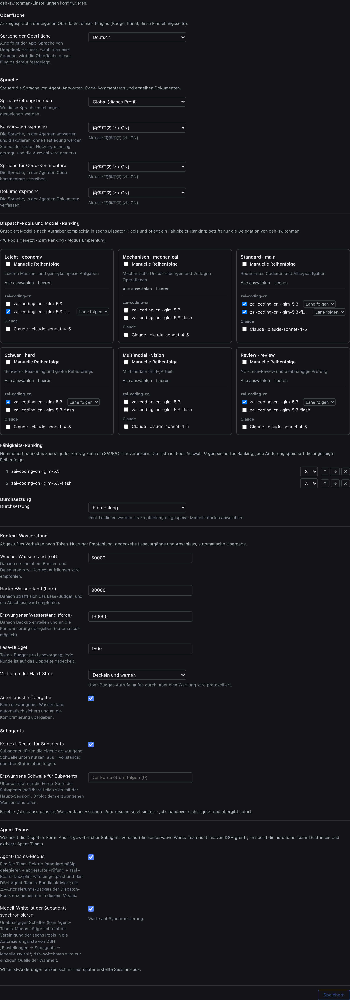

# dsh-switchman

[English](./README.md) | [简体中文](./README.zh.md) | [繁體中文](./README.zh-TW.md) | [日本語](./README.ja.md) | [한국어](./README.ko.md) | [Español](./README.es.md) | [Français](./README.fr.md) | **Deutsch** | [Italiano](./README.it.md) | [Português](./README.pt.md) | [Русский](./README.ru.md)

> **Die Switchman-Familie**, gleicher Autor, gleiche Dispositions-Philosophie: [opencode-switchman](https://github.com/mrzturn/opencode-switchman) (das OpenCode-Original) · [zcode-switchman](https://github.com/mrzturn/zcode-switchman) (die ZCode-Portierung) · **dsh-switchman** (dieses Repo, die DeepSeek-Harness-Edition).


> Dem Kontext einen Wasserzähler geben; jede Aufgabe findet ihre Spur von selbst.

## Warum dsh-switchman?

Wer lange mit DSH arbeitet, ärgert sich über zwei Dinge. Erstens werden Sessions mit der Zeit schwer: Die Historie bläht den Kontext auf Hunderttausende Token, das Modell vergisst, wird langsam und teuer, und ein manuelles /compact verliert Details. Zweitens erledigt das Hauptmodell alles selbst — Dateien nachschlagen, Tests laufen lassen, Daten abgleichen —, obwohl der Großteil dieser Arbeit auf ein billigeres Modell gehörte.

dsh-switchman ist ein Plugin für [DeepSeek Harness](https://github.com/deepseek-ai/deepseek-harness) (DSH). Nach der Installation wandelt sich das Hauptmodell vom Selbermacher zum Disponenten: Wasserstand messen, Spur wählen, Aufgaben vergeben, Abnahme prüfen. Es ist kein neues Modell, sondern ein Dispositionsregelwerk an DSH plus eine Einstellungsseite — und es tut sieben Dinge:

**1. Kontext-Wasserstand: lange Sessions platzen nicht.** Jede Runde zählt die Session-Tokens in Echtzeit; drei Stufen schrauben sich hoch: 50k (soft, einstellbar) mahnt „zeit zu delegieren“; 90k (hard) strafft das Einzellese-Budget und lenkt auf den Abschluss; 130k (force) übergibt automatisch — die Session wird zur Ablage geforkt, der Kontext komprimiert, der Nachfolger geweckt und läuft weiter, ohne dass die Aufgabe abreißt. Auch Hintergrund-Subagents, die im Moment der Übergabe noch laufen, gehen nicht verloren: id, Aufgabe und Report-Pfad landen im Übergabedokument; die fortgesetzte Session weiß, wo sie Reports abholt, und vergibt nichts doppelt. Jeder Subagent trägt eine eigene harte Obergrenze und verlässt nach seinem HANDOFF-Summary die Bühne. Passt dir die automatische Intervention nicht, übernimm jederzeit von Hand: `/ctx-pause` stoppt alle Wasserstands-Aktionen (die Messung läuft weiter, das Banner springt auf paused — es wird nur nicht mehr gehandelt), `/ctx-resume` holt alles jederzeit zurück — nach einem DSH-Neustart greift die Intervention auch von selbst wieder, ein temporäres Loslassen, kein Dauer-Aus; `/ctx-handover` wartet nicht, bis der Wasserstand oben ist, und startet dieselbe Übergabe auf Zuruf: Session zur Sicherung forken, Kontext verdichten, Fortsetzung wecken (die Session wird erst an eine Leerlauf-Grenze geführt, das Ergebnis kann daher ein paar Minuten dauern).

**2. Sechs Dispatch-Pools: das richtige Modell für jede Arbeit.** Economy (Massen-Kleinkram), Mechanical (Schablonen-Umformung), Main (tägliche Codearbeit), Hard (schwere Schlussfolgerungen und große Refactorings), Vision (Bilder), Review (unabhängige Prüfung). Auf der Einstellungsseite kreuzt man Kandidaten an, ordnet Prioritäten, vergibt Noten S/A/B/C und nagelt je Route einen Reasoning-Aufwand fest — das Aufwand-Dropdown führt die Stufen, die das Modell tatsächlich beherrscht, nicht generische drei. Im Prompt jeder Runde steckt eine `[SWITCHMAN:POOLS]`-Empfehlungstabelle; nach der wird vergeben. Drei Enforcement-Modi: aus / Empfehlung / Erzwingen (Erzwingen = Modelle außerhalb der Pools werden glatt abgelehnt).

**3. Agent-Teams-Modus: vom Einzeltäter zum Team.** Standardmäßig aus — nach der Installation ist es schlanke Subagent-Vergabe. Zwei unabhängige Schalter auf der Einstellungsseite:

- **Agent-Teams** — eingeschaltet injiziert das Team-Regelwerk (Delegation als Standard + gestufte Verifikation + Disziplin fürs gemeinsame Task-Board) und aktiviert die Agent-Teams-Funktion von DSH automatisch: das Hauptmodell rekrutiert Dauerteammates (`spawn_teammate`), legt Aufgaben auf das gemeinsame Task-Board (`team_task_*`) und tauscht Nachrichten mit Teammates aus. Wann ein Team fällig ist, ist klar geregelt: parallelisierbare unabhängige Subtasks, große in sich abgeschlossene Mengen, hoher Wasserstand im Hauptkontext, nötige Rollentrennung; einmalige Punktuntersuchungen bleiben beim Subagent. Wieder ausgeschaltet verschwinden die Team-Klauseln restlos, und laufenden Sessions werden die Team-Werkzeuge nie entrissen.
- **Whitelist-Sync für Subagent-Modelle** — DSH führt eine Autorisierungs-Whitelist „Agenten dürfen Modelle für Subagents wählen“: in einem Pool gewählte, aber nicht autorisierte Routen werden bei namentlicher Vergabe abgelehnt (im Teams-Modus mit ⚠ markiert). Dieser Schalter schreibt die Vereinigung aller sechs Pools en bloc in ebendiese Whitelist — switchman ist die einzige Quelle der Wahrheit, doppelte Konfiguration entfällt. Die Whitelist gilt als Snapshot je neuer Session; der Sync wirkt nur auf danach gestartete Sessions.

Die Session-Kopfzeile zeigt sofort, was los ist: das ⚡-Abzeichen „autonomes Team“ und ◇ mit dem tatsächlich genutzten Modell der Session; während einer laufenden Auto-Übergabe erscheint live „Übergabe läuft · Backup-Session / Kontext komprimieren / Nachfolger wecken“.

**4. Sprachpräferenzen: einmal fragen, für immer merken.** Je ein Dropdown für Antworten, Code-Kommentare und Dokumente; Geltungsbereich global oder je Projekt (`.switchman/lang.json`). Leer lassen geht auch — beim ersten Einsatz wird einmal in der Sprache deiner DSH-Oberfläche gefragt, danach hält sich jede Session daran.

**5. Oberflächensprache: das Plugin selbst spricht mit.** Oben auf der Einstellungsseite, im Bereich „Oberfläche“, sitzt das Dropdown „Oberflächensprache“ (Setting-Schlüssel `uiLocale`): Auto (Standard, folgt der Sprache der DeepSeek-Harness-App) oder jede eingebaute Oberflächensprache nach Wahl — die Optionen erscheinen stets als Eigenname der Sprache, unübersetzt. Umgeschaltet wird nur die Oberfläche des Plugins selbst (Abzeichen, Home-Panel, Einstellungsseite), nie die Sprache der DSH-App: die Auswahl ist sofortige Live-Vorschau ohne Neustart, wird nach dem Speichern gemerkt und beim nächsten Start wiederhergestellt, und jeder Fehler fällt auf die App-Sprache zurück; die Wörterbücher liegen vollständig im Plugin-Bundle, kein Download.

**6. Gestufte Verifikation: jede Änderung wird geprüft.** Änderungen über 20 Zeilen gehen an einen Tester; über 300 Zeilen oder an Kern- / Sicherheits- / Datenkonsistenz-Logik zusätzlich an einen unabhängigen Reviewer. Das Review-Modell wird am Modell des „Agents, der den Diff geschrieben hat“ verankert und möglichst vermieden; wenn der Pool es nicht hergibt, wird im Ergebnis DOWNGRADED deklariert. Ein „nutz kein Team“ genügt — sofort wieder Einzeltäter.

**7. `/vision`: reine Textmodelle kriegen trotzdem Bilder.** Kann das Hauptmodell keine Bilder lesen, lehnt DSH Bildnachrichten an der Tür ab. Bild einfügen, `/vision was ist an diesem Bild falsch` eintippen — das Bild geht an ein Modell aus dem Vision-Pool, das Urteil kommt in die laufende Session zurück. Über dem Eingabefeld steht vorab „das aktuelle Modell kann keine Bilder lesen“; wird der direkte Bildversand abgelehnt, wird die Nachricht automatisch als `/vision` umgeschrieben und erneut gesendet — kein manueller zweiter Versuch. Ohne konfigurierten Vision-Pool verweigert der Befehl und weist auf die Einstellungen.

Auch mit nur einem Modell lohnt sich die Installation — Wasserstandskontrolle und gestufte Verifikation hängen nicht von der Modellzahl ab; lange Single-Model-Sessions profitieren genauso.

## Mitgelieferte Skills

- **db-query** — Nur-Lese-Prüfung für MySQL / Redis: SQL-Abgleiche fahren, Cache-Keys / TTL nachschlagen, Konsistenz über Datenbanken hinweg prüfen; jede Schreiboperation wird abgelehnt. Vor der ersten Nutzung einmalig initialisieren (siehe unten).
- **git-commit-message** — erzeugt regelkonforme Commit-Texte; nur Text, nie git.
- **requirement-docs** — der einheitliche Standard für Anforderungsanalyse / PRD / Design-Dokumente; Ergebnisse werden nach `docs/requirements-and-design/` archiviert.

## Schnellstart

1. **Installieren** — in einer beliebigen Session den Agent ranlassen oder über die Plugin-Verwaltung der Web-Oberfläche:

   ```
   plugin_manager: install_bundle  target=dsh-switchman
   ```

   Oder aus einem lokalen Checkout installieren (link-Modus; nach einem Update per `remove_bundle` + `install_bundle` neu installieren):

   ```
   plugin_manager: install_bundle  target=/path/to/dsh-switchman
   ```

   Oder im Terminal mit dem `dsh`-Befehl — das Profil passend zur Betriebsart wählen:

   ```bash
   dsh plugin --profile web add dsh-switchman      # Web GUI
   dsh plugin --profile desktop add dsh-switchman   # Desktop-App
   ```

2. **DSH neu starten** — die App vollständig beenden und wieder öffnen (ein Seiten-Reload zählt nicht); erst dann erkennt die Client-Modultabelle das Bundle.

3. **Konfigurieren** — Einstellungen → dsh-switchman oder das „Switchman-Dispatch-Center“ in der Startseiten-Seitenleiste. Die Konfiguration ist eine einzige Seite und sieht so aus — einmal von oben nach unten durchgehen, fertig:

   

   - **Oberfläche** — die Oberflächensprache des Plugins selbst. Im Screenshot steht das Dropdown auf „Deutsch“ — eine Live-Vorschau des Umschaltens; der Auslieferungs-Standard ist Auto (folgt der App-Sprache von DSH). Eine gewählte Sprache schaltet die Seite sofort um und wird nach dem Speichern gemerkt; jederzeit zurück auf Auto.
   - **Sprachen** — die Sprachen der Agent-Ergebnisse. Der Geltungsbereich steht im Screenshot auf „Global (dieses Profil)“ (je Projekt ebenfalls möglich, jedes liest `.switchman/lang.json`); die drei Dropdowns Antwort / Code-Kommentare / Dokumente stehen im Screenshot alle auf Deutsch, jedes angezeigt als „Eigenname (Tag)“ — z. B. „Deutsch (de)“ — mit einer Statuszeile „aktuell: …“ darunter. Alle drei leer lassen geht auch — beim ersten Einsatz wird einmal gefragt, danach gemerkt.
   - **Dispatch-Pools** — sechs Karten in zwei Reihen zu drei: oben Economy / Mechanical / Main, unten Hard / Vision / Review. Kandidaten je Provider ankreuzen; ein Haken bei „manuelle Reihenfolge“ macht daraus eine nummerierte Prioritätsliste, sortiert mit ↑ ↓ ×; je Route lässt sich der Reasoning-Aufwand festnageln (Standard „wie Spur“). Die Zusammenfassungszeile oben aktualisiert live — im Screenshot: „4/6 Pools konfiguriert · 2 gerankt · Modus Empfehlung“.
   - **Fähigkeits-Ranking + Enforcement-Modus** — die Vereinigung der gewählten Modelle über alle sechs Pools, nach Fähigkeit sortiert, das stärkste zuerst (im Screenshot glm-5.3 auf S und glm-5.3-flash auf A verankert), umsortier- und kürzbar; Enforcement-Modus Empfehlung / Erzwingen (Erzwingen = Modelle außerhalb der Pools werden glatt abgelehnt).
   - **Agent-Teams** — die zwei Schalter für Team-Modus und Whitelist-Sync, beide standardmäßig aus; im Screenshot an, mit Sync-Statuszeile unter dem Schalter.
   - **Kontext-Wasserstand** — die drei Schwellen (im Screenshot 50000 / 90000 / 130000), das Einzellese-Budget (1500), das Verhalten der Hard-Stufe (drosselnd durchlassen / blockieren), der Schalter für die Auto-Übergabe und die eigenen Obergrenzen der Subagents — alles in diesem Bereich. Unten die Befehlszeile: `/ctx-pause` Eingriffe pausieren · `/ctx-resume` fortsetzen · `/ctx-handover` sofort sichern und übergeben (die Session wird erst an eine Leerlauf-Grenze geführt und dann komprimiert — das Ergebnis kann ein paar Minuten dauern).

4. **Prüfen** — in der Session-Kopfzeile erscheint das ⚡-Abzeichen „autonomes Team“ (daneben ◇ mit dem Modell der Session); oder das Modell einfach fragen: „Wie lautet die Überschrift des letzten Abschnitts deines System-Prompts?“ — die Antwort sollte das dsh-switchman-Regelwerk nennen.

**Einmalige Initialisierung von db-query** (Skript-Abhängigkeiten landen im Skill-Verzeichnis und verschmutzen das Projekt nicht):

```bash
bash <Installationsverzeichnis>/skills/db-query/scripts/setup.sh
```

## Funktionsweise

- Die Host-Hälfte (`index.js` + `host/`) injiziert die dynamischen System-Prompt-Abschnitte (Sprache / Spuren / Wasserstand / Teams), das Lese-Budget samt Enforcement-Doppeltor und vier Slash-Befehle (das ctx-Trio + `/vision`). Gespeicherte Einstellungen wirken ab der nächsten Prompt-Montage — kein Neustart.
- Die Client-Hälfte (`client.js`) rendert die Einstellungsseite, das ⚡-Abzeichen und die ◇-Modellmarkierung in der Session-Kopfzeile und die Live-Anzeige während einer Übergabe; Konfigurations-Snapshots werden über die Host-Routenfamilie gelesen und geschrieben.
- Der Eintrag „Switchman-Dispatch-Center“ in der Startseiten-Seitenleiste öffnet dieselbe Einstellungsseite mit einem Klick als Zentral-Panel; der ursprüngliche Einstellungszugang bleibt.
- `cordis.patch.yml` hält die Werks-Preset-Pluginliste vollständig intakt und erweitert nur den Persona-Suffix; die Agent-Teams-Werkzeuge selbst stammen aus dem Werks-Bundle und schalten sich mit dem Team-Modus automatisch scharf.

## Hinweise zur Wartung

- Ändert ein DSH-Upgrade die Werks-Preset-Pluginliste, `cordis.patch.yml` aus dem neuen `presets/*.patch.yml` neu synchronisieren (Doctrine-Suffix behalten) und neu installieren.
- Die Protokollzeilen (`[SWITCHMAN:LANG|POOLS|WATERMARK|TEAMS]`) sind bewusst englisch und byte-stabil — nicht lokalisieren.
- `npm pack --dry-run` muss die auditierte Form mit 50 Dateien / ~205 kB behalten (`docs/`-Screenshots kommen nicht ins Paket).

## License

MIT
