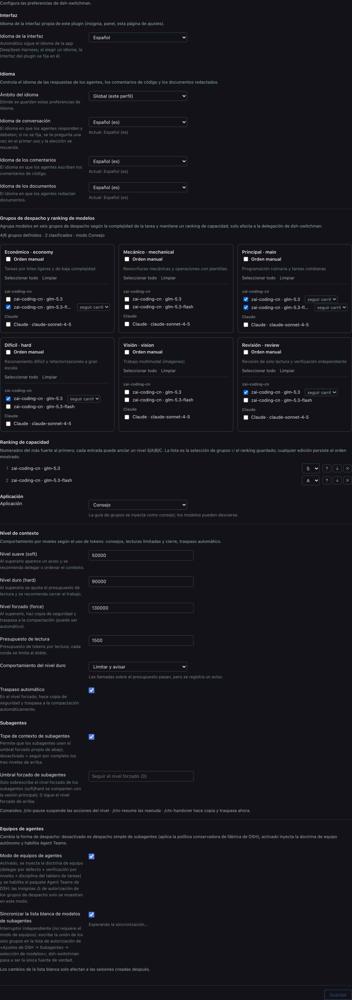

# dsh-switchman

[English](./README.md) | [简体中文](./README.zh.md) | [繁體中文](./README.zh-TW.md) | [日本語](./README.ja.md) | [한국어](./README.ko.md) | **Español** | [Français](./README.fr.md) | [Deutsch](./README.de.md) | [Italiano](./README.it.md) | [Português](./README.pt.md) | [Русский](./README.ru.md)

> **La familia switchman**, mismo autor, misma filosofía de despacho: [opencode-switchman](https://github.com/mrzturn/opencode-switchman) (el original para OpenCode) · [zcode-switchman](https://github.com/mrzturn/zcode-switchman) (el port para ZCode) · **dsh-switchman** (este repositorio, la versión para DeepSeek Harness).


> Contexto con medidor. Cada tarea encuentra su carril.

## Por qué lo necesitas

Trabajando con DSH, tarde o temprano te topas con dos cosas: la sesión pesa cada vez más — el historial hincha el contexto hasta cientos de miles de tokens, el modelo empieza a olvidar, a ir lento y a encarecerse, y el /compact manual de por medio pierde detalles en cada compresión; y el modelo principal lo hace todo él solo — leer un archivo, lanzar un test, cotejar datos: todo lo mastica él, cuando la mayor parte de ese trabajo correspondería a un modelo barato.

dsh-switchman es un plugin para [DeepSeek Harness](https://github.com/deepseek-ai/deepseek-harness) (DSH). Una vez instalado, el modelo principal deja de «hacerlo todo él solo» y pasa a ser el guardagujas: medir el nivel de agua, elegir el carril, repartir tareas y aceptar el trabajo. No es un modelo nuevo: es un reglamento de despacho enganchado a DSH, más una página de configuración. En concreto hace siete cosas:

**1. Nivel de agua del contexto: la sesión larga no se desborda.** Cada turno contabiliza los tokens de la sesión en vivo, y tres líneas de nivel aprietan por etapas: 50k (soft, ajustable) avisa «toca delegar»; 90k (hard) recorta el presupuesto de lectura por llamada y empuja al cierre; 130k (force) lanza la entrega automática — bifurca una copia de la sesión como respaldo, compacta el contexto y despierta la continuación, sin que el trabajo se corte. Los subagentes en segundo plano que sigan corriendo en el momento de la entrega tampoco se pierden: id, descripción de la tarea y ruta del informe quedan escritos en el documento de entrega, y la sesión que continúa sabe dónde recoger los informes en vez de volver a despachar el trabajo. Cada subagente despachado lleva su propio techo duro independiente: al alcanzarlo, termina con un resumen HANDOFF. Si la intervención automática no te encaja, toma el mando manualmente en cualquier momento: `/ctx-pause` detiene todas las acciones del nivel (la medición sigue corriendo, el aviso pasa a paused — solo deja de actuar), `/ctx-resume` lo devuelve en cualquier momento — tras reiniciar DSH la intervención también vuelve sola, lo sueltas por un rato, no lo apagas para siempre; `/ctx-handover` no espera a que el nivel llegue arriba y lanza esa misma entrega a demanda: bifurca una copia de respaldo, compacta el contexto, despierta la continuación (la sesión se conduce primero a la frontera de inactividad, así que el resultado puede tardar unos minutos).

**2. Seis pools de despacho: a cada trabajo, su modelo.** Pool ligero (economy, tareas pequeñas en lote), mecánico (mechanical, reescrituras con plantilla), principal (main, código del día a día), de alta dificultad (hard, razonamiento difícil y refactorizaciones a gran escala), multimodal (vision, leer imágenes) y de revisión (review, verificación independiente). En la página de ajustes marcas candidatos, ordenas prioridades (con anclaje opcional a las categorías S/A/B/C) y fijas un effort de razonamiento por ruta — el desplegable de categorías sale de los niveles que ese modelo soporta de verdad, no de tres genéricos. Cada turno, el prompt del modelo principal lleva consigo una tabla de recomendaciones `[SWITCHMAN:POOLS]`, y el trabajo se despacha siguiéndola. El modo de ejecución tiene tres estados: off / advice / enforce (enforce = los modelos fuera del pool se rechazan sin más).

**3. Modo Agent Teams: de ir por libre a llevar un equipo.** Desactivado por defecto: recién instalado solo hay despacho ligero por subagent. En la página de ajustes hay dos interruptores independientes:

- **Modo de equipo de agentes** — al activarlo se inyecta el reglamento de equipo (delegación por defecto + verificación por niveles + disciplina del tablero de tareas compartido) y se habilitan automáticamente los Agent Teams de DSH: el modelo principal puede reclutar compañeros residentes (`spawn_teammate`), asignarles trabajo en el tablero compartido (`team_task_*`) e intercambiar mensajes con ellos. Hay una disciplina clara sobre cuándo formar equipo: subtareas independientes que puedan ir en paralelo, trabajo abundante y autocontenido, nivel de agua del contexto principal ya alto o necesidad de separar roles; una investigación puntual de un solo uso sigue yendo por subagent. Si vuelves a apagar el interruptor, de las cláusulas de equipo no queda rastro, y las herramientas de equipo no se retiran de las sesiones en marcha.
- **Sincronizar la lista blanca de modelos de subagentes** — DSH tiene una lista blanca de autorización «permitir que los agentes elijan modelos para subagentes»: una ruta elegida en un pool pero no autorizada hace que el despacho explícito del modelo principal sea rechazado (en modo equipo, se marca con ⚠). Al encender este interruptor, la unión de los seis pools se escribe entera en esa lista blanca — switchman es la única fuente de verdad, sin configurar dos veces. La lista blanca entra en vigor según la instantánea de «nueva sesión»: la sincronización solo afecta a las sesiones abiertas a partir de entonces.

La cabecera de la sesión da un feedback visual claro: la insignia ⚡ «equipo autónomo» y ◇ con el modelo real de la sesión actual; mientras hay una entrega automática en marcha, aparece un aviso en vivo: «entrega en curso · sesión de respaldo / compactación del contexto / continuación despertada».

**4. Preferencias de idioma: pregunta una vez, lo recuerda para siempre.** Un desplegable para cada una de las tres: respuestas, comentarios de código y documentos; el ámbito puede ser global o por proyecto (`.switchman/lang.json`). No hace falta configurarlo: la primera vez que se necesite pregunta una sola vez, en el idioma de la interfaz de tu DSH, y una vez recordado, cada sesión lo respeta automáticamente.

**5. Idioma de la interfaz: el plugin también habla tu idioma.** En lo más alto de la página de ajustes aparece una nueva sección «Interfaz» con un desplegable «Idioma de la interfaz» (clave de ajuste `uiLocale`): Auto (por defecto — sigue el idioma de la app de DeepSeek Harness) o cualquier idioma en el que venga la interfaz del plugin, siempre con su endónimo, sin traducir. Solo cambia la interfaz del propio plugin — la insignia de la cabecera, el panel de inicio y la página de ajustes —, no el idioma de la app de DSH: la vista previa es inmediata y sin reinicio; al guardar, la elección se recuerda; el siguiente arranque la restaura; cualquier fallo vuelve al idioma de la app; y todos los diccionarios viajan dentro del bundle, sin descargas.

**6. Verificación por niveles: cambiado, comprobado.** Los cambios de más de 20 líneas pasan a verificación de un tester; los de más de 300 líneas, o que toquen lógica central / de seguridad / de consistencia de datos, pasan además a una revisión independiente de un reviewer. El modelo del reviewer se elige anclado al modelo del agente que escribió ese diff, esquivándolo cuando se puede; si en el pool no hay forma de esquivarlo, en la conclusión se declara DOWNGRADED. Dices «no uses equipos» y al instante vuelve al trabajo en solitario.

**7. `/vision`: hasta un modelo de solo texto puede con las imágenes.** Cuando el modelo principal no sabe leer imágenes, DSH rechaza en la puerta de entrada los mensajes con imágenes. Adjunta la imagen y escribe `/vision ¿qué está mal en esta imagen?` — la imagen se entrega a un modelo del pool multimodal para leerla, y la conclusión vuelve a la sesión actual. Sobre el cuadro de entrada aparece por adelantado el aviso «el modelo actual no sabe leer imágenes»; si un envío directo de imagen es rechazado, se reescribe una vez de forma automática a `/vision` y se reenvía, sin rehacer nada a mano; con el pool multimodal sin configurar, el comando se niega y da indicaciones de configuración.

¿Solo tienes un modelo? Sigue mereciendo la instalación — el control del nivel de agua y la verificación por niveles no dependen de cuántos modelos tengas, y una sesión larga con un solo modelo se beneficia igual.

## Skills incluidas

- **db-query** — verificación de MySQL / Redis en solo lectura: ejecuta SQL para cotejar datos, consulta claves de caché / TTL y la consistencia entre almacenes; rechaza cualquier escritura. Requiere inicialización en el primer uso (ver abajo).
- **git-commit-message** — genera el texto de commit conforme a la convención; solo texto, nunca hace git por ti.
- **requirement-docs** — una especificación unificada para análisis de requisitos / PRD / documentos de diseño; los entregables se archivan en `docs/requirements-and-design/`.

## Inicio rápido

1. **Instalar** — pide a un agent que lo ejecute en cualquier sesión, o ve a la página web de gestión de plugins:

   ```
   plugin_manager: install_bundle  target=dsh-switchman
   ```

   o instálalo desde un checkout local (en modo link; tras actualizar toca reinstalar con `remove_bundle` + `install_bundle`):

   ```
   plugin_manager: install_bundle  target=/path/to/dsh-switchman
   ```

   o instálalo desde una terminal con el comando `dsh` — elige el perfil según cómo ejecutes DSH:

   ```bash
   dsh plugin --profile web add dsh-switchman      # Web GUI
   dsh plugin --profile desktop add dsh-switchman   # app de escritorio
   ```

2. **Reiniciar DSH** — cierra la app por completo y vuelve a abrirla (recargar la página no cuenta) — solo así la tabla de módulos del cliente reconocerá el bundle.

3. **Configurar** — Ajustes → dsh-switchman, o «Central de despacho Switchman» en la barra lateral de la página de inicio. La configuración cabe en una sola página; así se ve — un repaso de arriba abajo y la tienes lista:

   

   - **Interfaz** — el idioma de la interfaz del propio plugin. En la captura está seleccionado «Español»: es la vista previa inmediata, toda la página cambia al momento; por defecto está «Auto», que sigue el idioma de la app de DSH. Se recuerda al guardar, y puedes volver a «Auto» cuando quieras.
   - **Idioma** — el idioma de lo que produce el agente. El ámbito de la captura es «Global (este perfil)» (también puede ser por proyecto, cada uno lee su `.switchman/lang.json`); los tres desplegables de respuestas / comentarios de código / documentos están fijados en «Español (es)», cada uno con su línea de estado «actual: …». Puedes no configurar ninguno: en el primer uso se pregunta una vez y se recuerda.
   - **Pools de despacho** — seis tarjetas en dos filas de tres: arriba ligero / mecánico / principal; abajo alta dificultad / multimodal / revisión. Cada tarjeta agrupa los modelos candidatos por proveedor; marca «orden manual» y se convierte en una lista de prioridades numerada que se reordena con ↑ ↓ ×; junto a cada ruta puedes fijar el effort de razonamiento (por defecto «seguir el carril»). La línea de resumen superior se actualiza en vivo; en la captura: «pools configurados: 4/6 · posiciones en el ranking: 2 · modo advice».
   - **Orden por capacidad + modo de ejecución** — la unión de los modelos elegidos en los seis pools, ordenada por capacidad y con los más fuertes delante (en la captura glm-5.3 anclado en S y glm-5.3-flash anclado en A); se puede reordenar y recortar; el modo de ejecución va de advice / enforce (enforce = los modelos fuera del pool se rechazan sin más).
   - **Equipo de agentes** — los dos interruptores, modo de equipo y sincronización de la lista blanca, vienen apagados; en la captura están encendidos, y debajo de cada uno hay una línea de estado de sincronización.
   - **Nivel de agua del contexto** — los tres umbrales (en la captura 50000 / 90000 / 130000), el presupuesto de lectura por llamada (1500), el comportamiento del umbral duro (dejar pasar limitando / bloquear), el interruptor de entrega automática y el techo independiente para subagentes: todo en esta zona. Abajo, una línea de comandos: `/ctx-pause` pausa la intervención · `/ctx-resume` la reanuda · `/ctx-handover` respalda y entrega ahora mismo (conduce la sesión a la frontera de inactividad antes de compactar; el resultado puede tardar unos minutos).

4. **Verificar** — en la cabecera de la sesión aparece la insignia ⚡ «equipo autónomo» (al lado, ◇ muestra el modelo de la sesión actual); o pregúntale directamente al modelo «¿cómo se titula la última sección de tu system prompt?» — debería mencionar el reglamento de dsh-switchman.

**Inicialización de db-query en el primer uso** (las dependencias del script se instalan dentro del directorio del skill y no ensucian el proyecto):

```bash
bash <install-dir>/skills/db-query/scripts/setup.sh
```

## Cómo funciona

- La mitad Host (`index.js` + `host/`) inyecta las secciones dinámicas del system prompt (idioma / carriles / nivel de agua / equipo), la doble compuerta de presupuesto de lectura y enforce, y cuatro comandos slash (el trío ctx + `/vision`). Todos los ajustes, una vez guardados, surten efecto en el siguiente ensamblado del prompt, sin reinicio.
- La mitad Client (`client.js`) pinta la página de ajustes, la insignia ⚡ y la marca de modelo ◇ en la cabecera de la sesión y el aviso dinámico de entrega en curso; las instantáneas de configuración se leen y escriben por la familia de rutas Host.
- La entrada «Central de despacho Switchman» en la barra lateral de la página de inicio: un clic abre esta misma página de configuración como panel central; la entrada de ajustes original se conserva.
- `cordis.patch.yml` conserva íntegra la lista de plugins de los presets de fábrica y solo amplía el persona suffix; las herramientas de Agent Teams en sí vienen del bundle de fábrica y se habilitan automáticamente al encender el modo equipo.

## Mantenimiento

- Si tras una actualización de DSH cambia la lista de plugins de los presets de fábrica, resincroniza `cordis.patch.yml` desde los nuevos `presets/*.patch.yml` (conserva el doctrine suffix) y reinstala.
- Las líneas de protocolo (`[SWITCHMAN:LANG|POOLS|WATERMARK|TEAMS]`) están deliberadamente en inglés y son estables byte a byte — no las localices.
- `npm pack --dry-run` debe mantenerse en la forma auditada de 50 archivos / ~205 kB (las capturas de `docs/` no entran en el paquete).

## License

MIT
