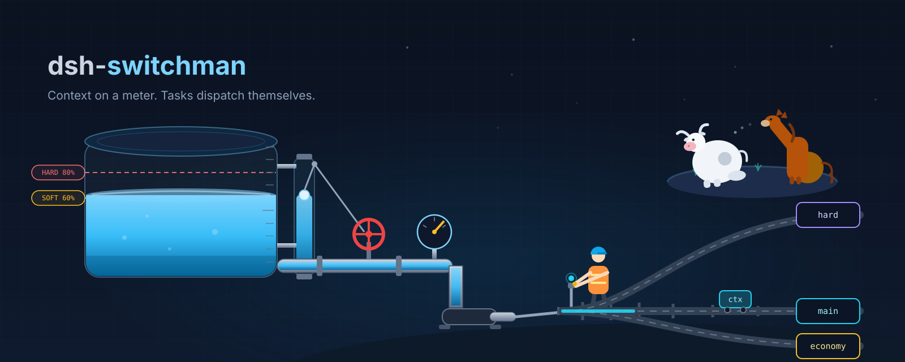
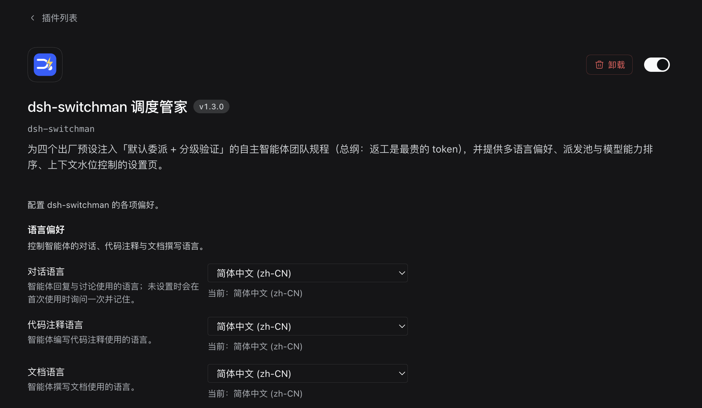
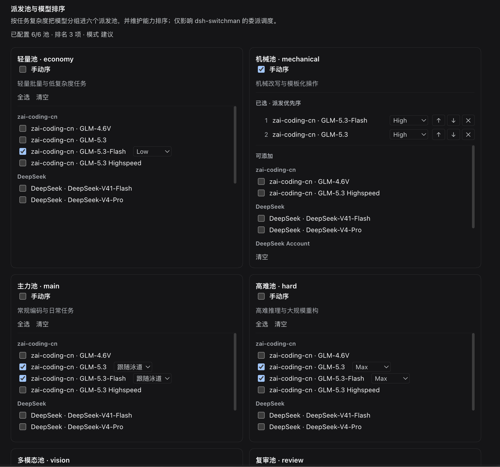
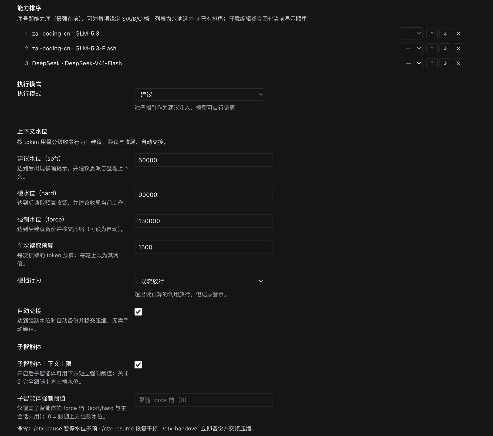

# dsh-switchman

[English](./README.md) | [简体中文](./README.zh.md) | [繁體中文](./README.zh-TW.md) | [日本語](./README.ja.md) | [한국어](./README.ko.md) | **Español** | [Français](./README.fr.md) | [Deutsch](./README.de.md) | [Italiano](./README.it.md) | [Português](./README.pt.md) | [Русский](./README.ru.md)

> **La familia switchman**, mismo autor, misma orquestación: [opencode-switchman](https://github.com/mrzturn/opencode-switchman) (el original para OpenCode) · [zcode-switchman](https://github.com/mrzturn/zcode-switchman) (el port para ZCode) · **dsh-switchman** (este repositorio, para DeepSeek Harness).



> Contexto en un medidor. Las tareas se despachan solas.

Un plugin para [DeepSeek Harness](https://github.com/deepseek-ai/deepseek-harness) (DSH). Una vez instalado, tu modelo principal deja de hacerlo todo por su cuenta y pasa a ser un despachador: medir el nivel de agua, elegir el carril, repartir la tarea, revisar el trabajo. Cuatro cosas:

**1. Control del nivel de agua del contexto.** Cada turno mide los tokens en vivo de la sesión. Soft (50k por defecto) aconseja delegar, hard (90k) aprieta el presupuesto de lectura por turno y empuja al cierre, force (130k) respalda la sesión y la entrega a la compactación — automáticamente. Usa una sesión todo el día; tu contexto nunca se ahoga en su propio historial. Cada subagente despachado lleva su propio hard cap y termina con un resumen HANDOFF al alcanzarlo.

**2. Despacho de seis carriles.** economy / mechanical / main / hard / vision / review — seis carriles cognitivos. Elige modelos candidatos por carril en la página de ajustes, ordénalos del más fuerte al más débil (anclaje de tiers S/A/B/C opcional) y fija un effort de razonamiento por ruta — el desplegable lista los niveles que cada modelo *realmente* soporta, no tres niveles genéricos. Cada prompt incluye una tabla `[SWITCHMAN:POOLS]` para que el modelo sepa a quién llamar; el modo `enforce` rechaza de plano los modelos fuera del pool.

**3. Preferencias de idioma.** Un desplegable para cada una: respuestas, comentarios de código y documentos redactados. ¿Sin definir? Se te pregunta una vez, se recuerda para siempre y cada sesión posterior lo sigue.

**4. Doctrina de delegación por defecto.** Sustituye la política de equipo conservadora que trae DSH («solo crea teammates cuando se lo pidan»): lo trivial se gestiona directamente (<200 líneas leídas, <50 modificadas), el trabajo real se delega por defecto; todo cambio se verifica — >20 líneas van a un tester, >300 líneas o lógica central van a un reviewer. Di «no uses equipos» y se aparta al instante.

¿Solo un modelo? Sigue mereciendo la pena — el control del nivel de agua y la doctrina no dependen de cuántos modelos tengas.

## Skills incluidas

- **db-query** — verificación de solo lectura sobre MySQL/Redis: ejecuta SQL para comprobar registros, claves de caché / TTLs y la consistencia entre almacenes. Rechaza toda escritura. Configuración única más abajo.
- **git-commit-message** — texto de commit conforme a la convención. Solo texto; nunca toca git.
- **requirement-docs** — una sola especificación para requisitos / PRD / documentos de diseño, archivada en `docs/requirements-and-design/`.

## Inicio rápido

1. **Instalar** — desde cualquier sesión de agente, o desde el gestor de plugins web:

   ```
   plugin_manager: install_bundle  target=dsh-switchman
   ```

   o desde un checkout local (enlazado; reejecuta `remove_bundle` + `install_bundle` tras incorporar cambios):

   ```
   plugin_manager: install_bundle  target=/path/to/dsh-switchman
   ```

2. **Reiniciar DSH** — cierra la app por completo y vuelve a abrirla (recargar la página no basta) para que la tabla de módulos del cliente recoja el bundle.

3. **Abrir la página de ajustes** — Settings → dsh-switchman. La primera pantalla son las preferencias de idioma: un desplegable para respuestas / comentarios / documentos, cada uno con una línea `current: …` en vivo. Sáltatelos si quieres — se te preguntará una vez y se recordará.

   

4. **Rellenar los seis pools** — cada tarjeta de pool lista candidatos agrupados por proveedor; marca los que quieras. Marca **manual order** y la tarjeta pasa a ser una lista de prioridades numerada con controles ↑ ↓ ×. El desplegable de effort junto a cada ruta seleccionada queda por defecto en *follow lane*; al fijarlo se listan los niveles que ese modelo realmente soporta (Low / High / Max…). Una línea de resumen sigue el progreso en vivo: “6/6 pools set · 3 ranked · mode advice”.

   

5. **Ranking y watermark** — el orden de la tabla de ranking es el orden de capacidad (el más fuerte primero), con tiers S/A/B/C opcionales; el modo de ejecución es `off` / advice / enforce (enforce = los modelos fuera del pool se rechazan). Debajo, la sección de watermark aprieta el comportamiento según el uso de tokens: tres umbrales, un presupuesto de lectura por llamada, el comportamiento del modo hard (cap / deny), un interruptor de entrega automática y un tope separado para subagentes. La última línea lleva los comandos: `/ctx-pause` para dejar de intervenir · `/ctx-resume` para reanudar · `/ctx-handover` para respaldar y entregar ya.

   

6. **Verificar** — la insignia ⚡ aparece junto al chip de preset en la cabecera de cualquier sesión; pregúntale al modelo “¿qué dice la última sección de tu system prompt?” — debería mencionar la doctrina de dsh-switchman.

**Configuración única de db-query** (las dependencias del script viven dentro del directorio del skill):

```bash
bash <install-dir>/skills/db-query/scripts/setup.sh
```

## Cómo funciona

- La mitad Host (`index.js` + `host/`) inyecta tres secciones dinámicas en el system prompt, las compuertas de presupuesto de lectura y de enforce, la captura automática de respuestas y tres comandos slash. Todos los ajustes son campos volátiles — los cambios guardados se aplican en el siguiente ensamblado del prompt, sin reinicio.
- La mitad Client (`client.js`) pinta la insignia ⚡ junto al chip de preset y la página de ajustes, mediante los servicios oficiales de formularios de ajustes.
- `cordis.patch.yml` vuelve a declarar textualmente la lista de plugins de cada preset incluido y solo amplía el sufijo de persona; las herramientas de Agent Teams en sí siguen viniendo del `@deepseek-ai/dsh-experimental-agent-team-profile` incluido.

## Mantenimiento

- Tras una actualización de DSH que cambie las listas de plugins de los presets incluidos, resincroniza `cordis.patch.yml` desde los nuevos `presets/*.patch.yml` (conserva el sufijo de doctrina) y reinstala.
- Las líneas de protocolo dirigidas al modelo (`[SWITCHMAN:LANG|POOLS|WATERMARK]`) son deliberadamente en inglés y byte-estables — no las localices.
- `npm pack --dry-run` debe mantenerse en la forma auditada de 34 archivos / ~111 kB (las capturas de `docs/` nunca se incluyen).

## Licencia

MIT
