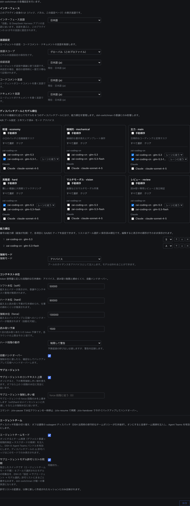

# dsh-switchman

[English](./README.md) | [简体中文](./README.zh.md) | [繁體中文](./README.zh-TW.md) | **日本語** | [한국어](./README.ko.md) | [Español](./README.es.md) | [Français](./README.fr.md) | [Deutsch](./README.de.md) | [Italiano](./README.it.md) | [Português](./README.pt.md) | [Русский](./README.ru.md)

> **switchman ファミリー**。同じ作者、同じディスパッチ思想：[opencode-switchman](https://github.com/mrzturn/opencode-switchman)（OpenCode 原版）· [zcode-switchman](https://github.com/mrzturn/zcode-switchman)（ZCode 移植版）· **dsh-switchman**（本リポジトリ、DeepSeek Harness 版）。


> コンテキストに水量計を付けろ。タスクは自分でレーンを見つける。

## なぜ必要か

DSHで長く作業していると、悩みが2つ出てくる。1つはセッションの肥大化。履歴がコンテキストを数十万トークンまで膨らませ、モデルは忘れ始め、遅くなり、高くつき、手動の /compact は細部を失う。もう1つは主力モデルが何でも自分でやること。ファイルを追い、テストを回し、データを突き合わせる——その大半は実は安いモデルに任せるべき仕事だ。

dsh-switchman は [DeepSeek Harness](https://github.com/deepseek-ai/deepseek-harness)（DSH）のプラグインだ。入れると主モデルは「自分で作業する」役から運転指令へ変わる：水位を測り、レーンを選び、タスクを投げ、受け入れを確認する。新モデルではない。DSHに取り付けるディスパッチ規程と設定ページであり、7つのことを行う。

**1. コンテキスト水位：長いセッションを破裂させない。** 毎ターンリアルタイムでセッショントークンを数え、3本の水位線が段階的に締め上げる：50k（soft、調整可）は「そろそろ委譲を」、90k（hard）は1回の読み取り予算を引き締めて収束へ導き、130k（force）で自動引き継ぎ——セッションをフォークして記録に残し、コンテキストを圧縮し、後継を起こして継続する。タスクは切れない。引き継ぎの瞬間に走っているバックグラウンドのサブエージェントも失われない：id・タスク・レポートパスを引き継ぎドキュメントに書き込み、再開したセッションはどこでレポートを受け取るか分かっていて、同じ仕事を二度投げない。各サブエージェントは独立のハード上限を持ち、到達したら HANDOFF サマリを書いて退場する。

**2. 6つのディスパッチプール：仕事に合ったモデルを。** economy（小口の雑務のバッチ）、mechanical（テンプレート化された書き換え）、main（日常のコーディング）、hard（難問推論と大規模リファクタリング）、vision（画像）、review（独立検証）。設定ページで候補にチェックを付け、優先順を決め、S/A/B/C のグレードを付け、さらにルートごとに思考強度をピン留めできる——強度のドロップダウンはそのモデルが実際に対応するレベルから立ち上がり、汎用の3段ではない。主モデルの毎ターンのプロンプトには必ず `[SWITCHMAN:POOLS]` 推薦表が載り、表に従って投げる。実行モードは3態：オフ / アドバイス / 強制（強制＝プール外のモデルは即拒否）。

**3. Agent Teams モード：単独作業からチーム運用へ。** 既定はオフで、インストール直後は軽量なサブエージェント運用。設定ページに独立したトグルが2つ：

- **エージェントチーム**——オンにするとチーム規程（デフォルト委譲＋段階的検証＋共有タスクボードの規律）を注入し、DSH の Agent Teams を自動で有効にする：主モデルは常駐のチームメイトを引く（`spawn_teammate`）、共有タスクボードに仕事を置く（`team_task_*`）、チームメイトとメッセージをやり取りする。チームを組むべき場面は規律で決まっている：並列化できる独立サブタスク、量が多く自己完結した作業、主コンテキストの水位が既に高い、役割の分離が必要——使い捨ての単発調査は引き続きサブエージェントへ。トグルを戻せばチーム条項は跡形なく消え、実行中のセッションからチームツールを引き上げることもない。
- **サブエージェントモデルのホワイトリスト同期**——DSH には「エージェントにサブエージェントのモデル選択を許可する」認可リストがある：プールで選んだのに認可されていないルートは、名指しでの発令が拒否される（チームモードでは ⚠ 表示）。このトグルを入れると、6プールの和集合がまるごとそのリストへ書き込まれる——switchman が唯一の情報源になり、二重管理は不要。リストは「新規セッション」単位のスナップショットで効き、同期はそれ以降に開いたセッションにだけ効く。

セッションヘッダーには即座に分かるフィードバックがある：⚡「自律チーム」バッジ、◇ 現在セッションの実際のモデル。自動引き継ぎの実行中は「引き継ぎ実行中 ・ バックアップセッション / コンテキスト圧縮 / 後継の起動」のライブ表示が出る。

**4. 言語設定：一度聞けば、ずっと守る。** 返信・コードコメント・ドキュメントの3言語にそれぞれドロップダウンが1つ。スコープはグローバルまたはプロジェクト単位（`.switchman/lang.json`）。未設定のままでもよい——初回使用時に DSH インターフェースの言語で一度だけ尋ね、覚えれば以後すべてのセッションが守る。

**5. インターフェース言語：プラグイン自身もあなたの言葉で。** 設定ページ最上部の「インターフェース」領域にある「インターフェース言語」ドロップダウン（設定キー `uiLocale`）：自動（既定、DeepSeek Harness アプリの言語に追従）または内蔵のインターフェース言語から任意に選択——選択肢は常にその言語の原語名のまま、翻訳しない。切り替わるのはプラグイン自身のインターフェース（バッジ・ホームパネル・設定ページ）だけで、DSH アプリの言語は動かさない：選択はその場でプレビュー、再起動不要、保存後に記憶し次回起動時に復元、失敗時はすべてアプリの言語へフォールバックする。辞書はすべてプラグインバンドルに内蔵、ダウンロード不要。

**6. 段階的検証：直したら必ず検査する。** 20行超の変更は tester へ。300行超、またはコア / セキュリティ / データ整合性に触れる変更は、さらに reviewer の独立再審へ。再審モデルは「その diff を書いたエージェント」のモデルを錨に選び、極力避ける。プール内で避けきれない場合は、結論の中で DOWNGRADED と宣言される。「チームは使うな」の一言で即座に単独へ戻る。

**7. `/vision`：テキスト専用モデルでも画像を扱える。** 主力モデルが画像を読めないとき、DSH は画像付きメッセージを入口で拒否する。画像を貼って `/vision この画像のどこが悪い` と打てば、画像は vision プールのモデルへ渡され、結論は現在のセッションに戻る。入力欄の上には「現在のモデルは画像を読めません」の事前表示が出る。画像を直接送って拒否されたら、自動で `/vision` に書き換えて再送するので手直しは不要。vision プールが未設定ならコマンドは拒否し、設定への案内を出す。

モデルが1つでも入れる価値はある——水位制御と段階的検証はモデルの数と無関係で、単一モデルの長いセッションも同じく恩恵を受ける。

## 同梱スキル

- **db-query**——MySQL / Redis の読み取り専用検証：SQL でデータを突き合わせ、キャッシュキー / TTL を調べ、クロスDBの整合性を検査する。書き込みは一切拒否。初回使用前に初期化が必要（下記）。
- **git-commit-message**——規約に沿ったコミットメッセージを生成する。テキストだけ出し、git を代行することはない。
- **requirement-docs**——要件分析 / PRD / 設計ドキュメントの統一規程。成果物は `docs/requirements-and-design/` にアーカイブする。

## クイックスタート

1. **インストール**——任意のセッションで agent に実行させるか、Web のプラグイン管理ページで：

   ```
   plugin_manager: install_bundle  target=dsh-switchman
   ```

   またはローカルのチェックアウトから（link 方式。更新後は `remove_bundle` + `install_bundle` で入れ直す）：

   ```
   plugin_manager: install_bundle  target=/path/to/dsh-switchman
   ```

   または端末で `dsh` コマンドを——実行方法に合う profile を選ぶ：

   ```bash
   dsh plugin --profile web add dsh-switchman      # Web GUI
   dsh plugin --profile desktop add dsh-switchman   # デスクトップアプリ
   ```

2. **DSH を再起動**——アプリを完全に終了して開き直す（ページの再読み込みでは不可）。そうしてはじめてクライアントのモジュール表がこの bundle を認識する。

3. **設定**——設定 → dsh-switchman、またはホームサイドバーの「Switchman ディスパッチセンター」。設定は1ページだけ。見た目はこうで、上から下へ一度なぞれば終わり：

   

   - **インターフェース**——プラグイン自身の UI 言語。図のドロップダウンは「日本語」——切り替えのライブプレビュー。出荷時の既定は「自動」（DSH アプリの言語に追従）。言語を選べばその場でページ全体が切り替わり、保存後に記憶、いつでも「自動」に戻せる。
   - **言語**——エージェントの成果物の言語。図のスコープは「グローバル（この profile）」（プロジェクト単位も可、それぞれ `.switchman/lang.json` を読む）。返信 / コードコメント / ドキュメントの3つのドロップダウンは図ではすべて日本語で、各項目は「原語名（タグ）」表示——例えば「日本語 (ja)」。下には「現在：…」の状態行が付く。全部未設定でもよい——初回使用時に一度尋ね、覚えたらそれを使う。
   - **ディスパッチプール**——六枚のカードが三列二段（上段 economy・mechanical・main、下段 hard・vision・review）。カードはプロバイダーごとに候補モデルにチェックを付ける。「手動順」にチェックすると番号付きの優先リストになり、↑ ↓ × で並べ替える。各ルートには思考強度をピン留めできる（既定「レーンに追従」）。最上部の集計行はリアルタイムに更新され、図では「4/6 プール構成済み ・ 順位 2 件 ・ モード アドバイス」。
   - **能力順位 + 実行モード**——6プールの選択モデルの和集合を能力順に並べ、最強を先頭に（図では glm-5.3 を S、glm-5.3-flash を A に錨付き）。並べ替え・削減は自由。実行モードはアドバイス / 強制（強制＝プール外のモデルを即拒否）。
   - **エージェントチーム**——チームモードとホワイトリスト同期の2つのトグル。既定は両方オフ。図ではオンで、トグルの下に同期状態行がある。
   - **コンテキスト水位**——3段の閾値（図で 50000 / 90000 / 130000）、1回の読み取り予算（1500）、hard 段の挙動（絞って通す / ブロック）、自動引き継ぎトグル、サブエージェントの独立上限——すべてこの領域にある。最下部のコマンド行：`/ctx-pause` 介入を一時停止 ・ `/ctx-resume` 再開 ・ `/ctx-handover` すぐバックアップして引き継ぎ（セッションをアイドル境界まで導いてから圧縮するため、結果には数分かかることがある）。

4. **確認**——セッションヘッダーに ⚡「自律チーム」バッジ（隣の ◇ に現在セッションのモデル）。あるいはモデルに「あなたのシステムプロンプトの最終段落の見出しは何か」と尋ねる——答えに dsh-switchman の規程が出てくれば正しい。

**db-query の初回初期化**（スクリプトの依存はスキルディレクトリ内に置かれ、プロジェクトを汚さない）：

```bash
bash <インストールディレクトリ>/skills/db-query/scripts/setup.sh
```

## 仕組み

- ホスト側（`index.js` + `host/`）が動的なシステムプロンプト段（言語 / レーン / 水位 / チーム）、読み取り予算と enforce の二重ゲート、4つのスラッシュコマンド（ctx 3点セット + `/vision`）を注入する。保存した設定は次のターンのプロンプト組み立てで即効き、再起動は不要。
- クライアント側（`client.js`）は設定ページ、セッションヘッダーの ⚡ バッジと ◇ モデル表示、引き継ぎ中のライブ表示を描画する。設定スナップショットは Host のルートファミリー経由で読み書きする。
- ホームサイドバーの「Switchman ディスパッチセンター」入口は、ワンクリックで同じ設定ページを中央パネルで開く。元の設定入口は残る。
- `cordis.patch.yml` は出荷プリセットのプラグイン一覧を完全に保ち、persona suffix だけを拡張する。Agent Teams ツール本体は出荷バンドル由来で、チームモードをONにすると自動で有効になる。

## メンテナンスの注意

- DSH のアップグレードで出荷プリセットのプラグイン一覧が変わったら、新しい `presets/*.patch.yml` から `cordis.patch.yml` を再同期（doctrine suffix は保持）し、入れ直す。
- プロトコル行（`[SWITCHMAN:LANG|POOLS|WATERMARK|TEAMS]`）は意図的に英語のままバイト安定——ローカライズしない。
- `npm pack --dry-run` は監査済みの 50 ファイル / ~205 kB の形状を保つこと（`docs/` のスクリーンショットはパッケージに入らない）。

## License

MIT
