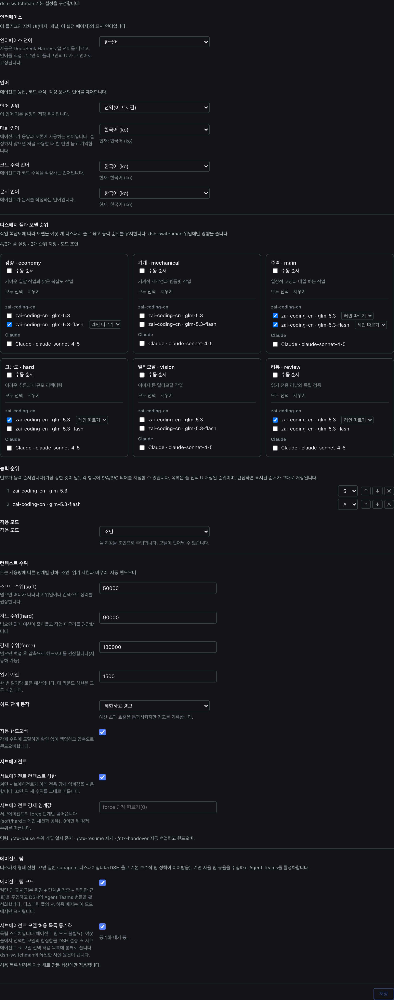

# dsh-switchman

[English](./README.md) | [简体中文](./README.zh.md) | [繁體中文](./README.zh-TW.md) | [日本語](./README.ja.md) | **한국어** | [Español](./README.es.md) | [Français](./README.fr.md) | [Deutsch](./README.de.md) | [Italiano](./README.it.md) | [Português](./README.pt.md) | [Русский](./README.ru.md)

> **switchman 패밀리**, 같은 저자, 같은 디스패치 사상: [opencode-switchman](https://github.com/mrzturn/opencode-switchman)(OpenCode 원판) · [zcode-switchman](https://github.com/mrzturn/zcode-switchman)(ZCode 이식판) · **dsh-switchman**(이 저장소, DeepSeek Harness 버전).


> 컨텍스트에 수도계를 달면, 태스크가 스스로 차선을 찾는다.

## 왜 필요한가

DSH로 오래 일하면 귀찮은 일이 두 가지 생긴다. 첫째, 세션이 길어질수록 무거워진다. 히스토리가 컨텍스트를 수십만 토큰까지 밀어 올리면 모델은 까먹기 시작하고, 느려지고, 비싸진다. 수동 /compact 은 디테일을 잃는다. 둘째, 주력 모델이 뭐든 직접 한다. 파일을 뒤지고, 테스트를 돌리고, 데이터를 맞춰 보는 일 — 그 대부분은 사실 싼 모델에게 맡겨야 할 일이다.

dsh-switchman은 [DeepSeek Harness](https://github.com/deepseek-ai/deepseek-harness)(DSH) 플러그인이다. 설치하면 주 모델은 '직접 일하기'에서 디스패처로 바뀐다: 수위를 재고, 차선을 고르고, 태스크를 던지고, 인수를 검수한다. 새 모델이 아니다. DSH에 얹는 디스패치 규정과 설정 화면이며, 일곱 가지 일을 한다.

**1. 컨텍스트 수위: 긴 세션도 터지지 않게.** 매 턴 세션 토큰을 실시간으로 세고 세 단계 수위선이 순서대로 조인다: 50k(soft, 조정 가능)은 '이제 위임할 때', 90k(hard)은 1회 읽기 예산을 조이고 마무리로 유도하며, 130k(force)은 자동 인계다 — 세션을 fork해 기록으로 남기고, 컨텍스트를 압축하고, 후속을 깨워 이어 달린다. 태스크는 끊기지 않는다. 인계 순간에 돌고 있던 백그라운드 서브에이전트도 잃지 않는다: id, 태스크, 보고서 경로를 인계 문서에 적어 두어 재개된 세션은 어디서 보고를 받을지 알고 중복 발령하지 않는다. 서브에이전트마다 독립 하드 상한이 있어 도달하면 HANDOFF 요약을 쓰고 퇴장한다.

**2. 6개 디스패치 풀: 일에 맞는 모델.** economy(잔일 배치), mechanical(템플릿 개작), main(일상 코딩), hard(고난도 추론과 대규모 리팩터링), vision(이미지), review(독립 검증). 설정 페이지에서 후보에 체크하고, 우선순위를 정하고, S/A/B/C 등급을 매기고, 루트별로 추론 강도를 고정할 수도 있다 — 강도 드롭다운은 그 모델이 실제 지원하는 수준에서 오고, 범용 3단이 아니다. 주 모델의 매 턴 프롬프트에는 항상 `[SWITCHMAN:POOLS]` 추천표가 실리고, 표대로 발령한다. 실행 모드는 세 가지: 끔 / 조언 / 강제(강제 = 풀 밖 모델은 즉시 거절).

**3. Agent Teams 모드: 혼자 일하던 데서 팀 운영으로.** 기본은 꺼져 있고, 설치 직후에는 가벼운 subagent 발령이다. 설정 페이지에 독립 토글 두 개:

- **에이전트 팀** — 켜면 팀 규정(기본 위임 + 단계별 검증 + 공유 태스크보드 규율)을 주입하고 DSH의 Agent Teams를 자동으로 켠다: 주 모델은 상주 팀원(`spawn_teammate`)을 뽑고, 공유 태스크보드(`team_task_*`)에 일을 올리고, 팀원과 메시지를 주고받는다. 팀을 꾸릴 때는 명확한 규율이 있다: 병렬로 돌릴 수 있는 독립 서브태스크, 양이 많고 자립적인 작업, 주 컨텍스트 수위가 이미 높음, 역할 분리 필요 — 한 번 쓰고 끝내는 단발 조사는 여전히 subagent로. 토글을 끄면 팀 조항은 흔적 없이 사라지고, 돌고 있는 세션에서 팀 도구를 걷어 가지도 않는다.
- **서브에이전트 모델 화이트리스트 동기화** — DSH에는 '에이전트가 서브에이전트 모델을 고르도록 허용' 인가 화이트리스트가 있다: 풀에서 골랐지만 인가되지 않은 루트는 지명 발령이 거절된다(팀 모드에서는 ⚠ 표시). 이 토글을 켜면 6개 풀의 합집합이 통째로 그 화이트리스트에 기록된다 — switchman이 유일한 원천이 되어 이중 설정이 없어진다. 화이트리스트는 '새 세션' 스냅샷으로 적용되고, 동기화는 그 이후에 새로 연 세션에만 적용된다.

세션 헤더에는 바로 보이는 피드백이 있다: ⚡ '자율 팀' 배지, ◇ 현재 세션의 실제 모델. 자동 인계가 진행 중일 때는 '인계 진행 중 · 백업 세션 / 컨텍스트 압축 / 후속 기상' 실시간 표시가 뜬다.

**4. 언어 기본 설정: 한 번 물으면 평생 기억.** 답장, 코드 주석, 문서 세 가지 언어에 각각 드롭다운 하나. 범위는 전역 또는 프로젝트별(`.switchman/lang.json`). 안 두어도 된다 — 처음 쓸 때 DSH 인터페이스 언어로 한 번 물어보고, 기억하면 이후 모든 세션이 따른다.

**5. 인터페이스 언어: 플러그인도 당신 말을 쓴다.** 설정 페이지 맨 위 '인터페이스' 영역의 '인터페이스 언어' 드롭다운(설정 키 `uiLocale`): 자동(기본, DeepSeek Harness 앱 언어를 따름) 또는 내장 인터페이스 언어 중 아무거나 직접 선택 — 옵션은 항상 그 언어의 원명 그대로, 번역하지 않는다. 바뀌는 건 플러그인 자신의 인터페이스(배지, 홈 패널, 설정 페이지)뿐이고 DSH 앱 언어는 건드리지 않는다: 선택 즉시 미리보기, 재시작 불필요, 저장 후 기억하고 다음 실행 때 복원, 실패 시 모두 앱 언어로 되돌아간다. 사전은 전부 플러그인 번들에 내장, 다운로드 불필요.

**6. 단계별 검증: 고치면 반드시 검사.** 20줄 넘는 변경은 tester에게. 300줄 초과, 또는 코어 / 보안 / 데이터 일관성 로직을 건드린 변경은 reviewer 독립 재검까지. 재검 모델은 '그 diff를 쓴 에이전트'의 모델을 앵커로 골라 최대한 피하고, 풀 안에서 피할 수 없으면 결론에 DOWNGRADED를 명시한다. "팀 쓰지 마" 한마디면 즉시 혼자 일하는 모드로 돌아간다.

**7. `/vision`: 텍스트 전용 모델도 이미지를 다룬다.** 주력 모델이 이미지를 못 읽으면 DSH는 이미지 포함 메시지를 입구에서 거절한다. 이미지를 붙이고 `/vision 이 이미지 어디가 잘못됐어`라고 입력하면 이미지는 vision 풀 모델에게 넘어가고 결론이 현재 세션으로 돌아온다. 입력창 위에는 '현재 모델은 이미지를 읽을 수 없음' 안내가 미리 뜬다. 이미지를 직접 보내다 거절되면 자동으로 `/vision`으로 고쳐 다시 보낸다 — 손으로 다시 할 필요 없다. vision 풀이 비어 있으면 명령은 거절하고 설정 안내를 준다.

모델이 하나뿐이어도 설치할 가치가 있다 — 수위 제어와 단계별 검증은 모델 수와 무관하고, 단일 모델의 긴 세션도 같은 혜택을 본다.

## 번들 스킬

- **db-query** — MySQL / Redis 읽기 전용 검증: SQL로 데이터를 대조하고, 캐시 키 / TTL을 조회하고, DB 간 일관성을 검사한다. 쓰기는 일절 거절. 첫 사용 전 초기화 필요(아래).
- **git-commit-message** — 규칙에 맞는 커밋 메시지를 만든다. 텍스트만 내고 git을 대신 실행하지 않는다.
- **requirement-docs** — 요구사항 분석 / PRD / 설계 문서의 통일 규범. 산출물은 `docs/requirements-and-design/`에 보관된다.

## 빠른 시작

1. **설치** — 아무 세션이나 agent에게 실행시키거나, Web 플러그인 관리 페이지에서:

   ```
   plugin_manager: install_bundle  target=dsh-switchman
   ```

   또는 로컬 체크아웃에서 설치(link 방식. 업데이트 후에는 `remove_bundle` + `install_bundle`으로 재설치):

   ```
   plugin_manager: install_bundle  target=/path/to/dsh-switchman
   ```

   또는 터미널에서 `dsh` 명령으로 — 실행 방식에 맞는 profile을 고른다:

   ```bash
   dsh plugin --profile web add dsh-switchman      # Web GUI
   dsh plugin --profile desktop add dsh-switchman   # 데스크톱 앱
   ```

2. **DSH 재시작** — 앱을 완전히 끄고 다시 연다(페이지 새로고침은 안 된다). 그래야 클라이언트 모듈 테이블이 이 번들을 알아본다.

3. **설정** — 설정 → dsh-switchman, 또는 홈 사이드바의 'Switchman 디스패치 센터'. 설정은 한 페이지, 생김새는 이렇다. 위에서 아래로 한 번 훑으면 끝:

   

   - **인터페이스** — 플러그인 자체 UI 언어. 그림의 드롭다운은 '한국어' — 전환 미리보기. 출고 기본은 '자동'(DSH 앱 언어를 따름). 언어를 고르면 그 자리에서 페이지 전체가 바뀌고 저장 후 기억된다. 언제든 '자동'으로 되돌릴 수 있다.
   - **언어** — 에이전트 산출물의 언어. 그림의 범위는 '전역(이 profile)'(프로젝트별도 가능, 각자 `.switchman/lang.json`을 읽는다). 답장 / 코드 주석 / 문서 세 드롭다운은 그림에서 모두 한국어, 각 항목은 '원명 (태그)' 표기 — 예: '한국어 (ko)'. 아래에는 '현재: …' 상태 줄이 따른다. 셋 다 안 두어도 된다 — 처음 쓸 때 한 번 물어보고 기억하면 그걸 쓴다.
   - **디스패치 풀** — 두 줄에 세 장씩 여섯 카드(위 economy/mechanical/main, 아래 hard/vision/review). 카드는 공급자별로 묶은 후보 모델에 체크. '수동 순서'에 체크하면 번호 매긴 우선 목록이 되고 ↑ ↓ ×로 순서를 정한다. 루트별로 추론 강도를 고정할 수 있다(기본 '레인 따름'). 맨 위 요약 줄은 실시간 갱신되고 그림에서는 '4/6 풀 구성됨 · 순위 2건 · 모드 조언'.
   - **능력 순위 + 실행 모드** — 6개 풀에서 선택한 모델의 합집합을 능력순으로, 최강이 맨 앞(그림에서 glm-5.3은 S, glm-5.3-flash는 A에 고정). 순서 조정과 삭제가 가능하다. 실행 모드는 조언 / 강제(강제 = 풀 밖 모델 즉시 거절).
   - **에이전트 팀** — 팀 모드와 화이트리스트 동기화 두 토글. 기본은 둘 다 꺼짐. 그림에서는 켜져 있고 토글 아래에 동기화 상태 줄이 있다.
   - **컨텍스트 수위** — 3단 임계값(그림에서 50000 / 90000 / 130000), 1회 읽기 예산(1500), hard 단계 동작(조여 통과 / 차단), 자동 인계 토글, 서브에이전트 독립 상한이 모두 이 영역에 있다. 맨 아래 명령 줄: `/ctx-pause` 개입 일시정지 · `/ctx-resume` 재개 · `/ctx-handover` 즉시 백업하고 인계(세션을 유휴 경계로 이끈 뒤 압축하므로 결과까지 몇 분 걸릴 수 있다).

4. **확인** — 세션 헤더에 ⚡ '자율 팀' 배지(옆 ◇에 현재 세션 모델)가 뜬다. 또는 모델에게 '너의 시스템 프롬프트 마지막 단락 제목이 뭐야?'라고 물어보라 — 답에 dsh-switchman 규정이 언급되어야 한다.

**db-query 첫 사용 초기화**(스크립트 의존성은 스킬 디렉터리 안에 설치되어 프로젝트를 오염시키지 않는다):

```bash
bash <설치-디렉터리>/skills/db-query/scripts/setup.sh
```

## 작동 원리

- 호스트 쪽(`index.js` + `host/`)이 동적 시스템 프롬프트 단(언어 / 레인 / 수위 / 팀), 읽기 예산과 enforce 이중 게이트, 슬래시 명령 4개(ctx 3종 + `/vision`)를 주입한다. 설정을 저장하면 다음 턴 프롬프트 조립 때 바로 반영되고 재시작은 필요 없다.
- 클라이언트 쪽(`client.js`)은 설정 페이지, 세션 헤더의 ⚡ 배지와 ◇ 모델 표시, 인계 진행 중 동적 표시를 그린다. 설정 스냅샷은 Host 라우트 패밀리를 통해 읽고 쓴다.
- 홈 사이드바의 'Switchman 디스패치 센터' 입구는 클릭 한 번으로 같은 설정 페이지를 중앙 패널로 연다. 기존 설정 입구는 그대로 둔다.
- `cordis.patch.yml`은 출고 프리셋 플러그인 목록을 온전히 유지하고 persona suffix만 확장한다. Agent Teams 도구 본체는 출고 번들에서 오며 팀 모드를 켜면 자동으로 활성화된다.

## 유지보수 주의사항

- DSH 업그레이드 후 출고 프리셋 플러그인 목록이 바뀌면 새 `presets/*.patch.yml`에서 `cordis.patch.yml`을 다시 동기화하고(doctrine suffix 유지) 재설치한다.
- 프로토콜 행(`[SWITCHMAN:LANG|POOLS|WATERMARK|TEAMS]`)은 의도적으로 영어 그대로 바이트 안정으로 둔다 — 현지화하지 않는다.
- `npm pack --dry-run`은 감사된 50 파일 / ~205 kB 형태를 유지해야 한다(`docs/` 스크린샷은 패키지에 들어가지 않는다).

## License

MIT
