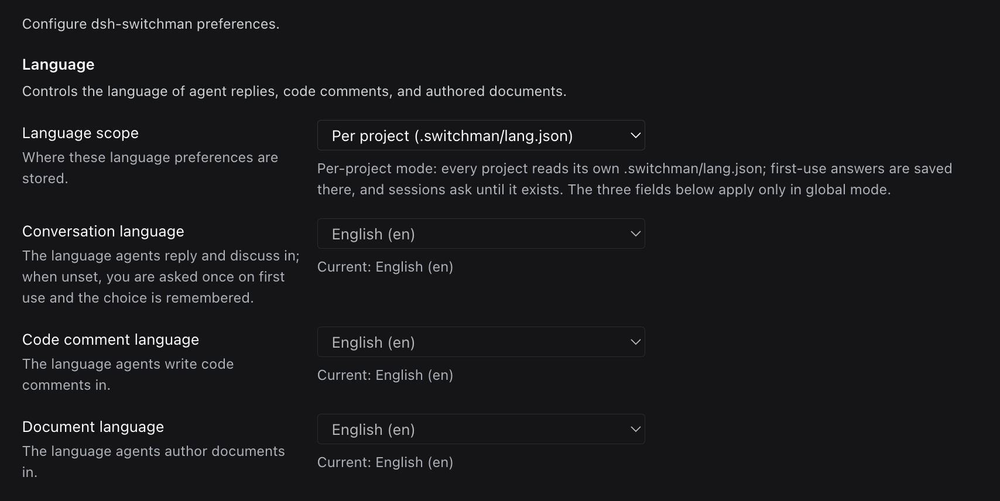
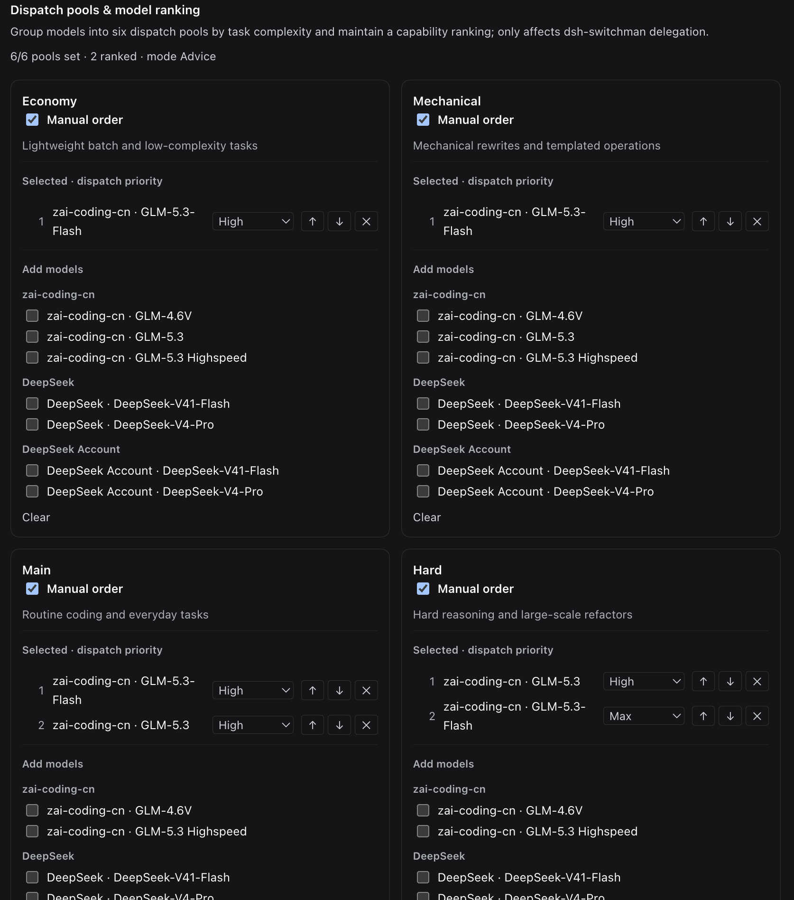
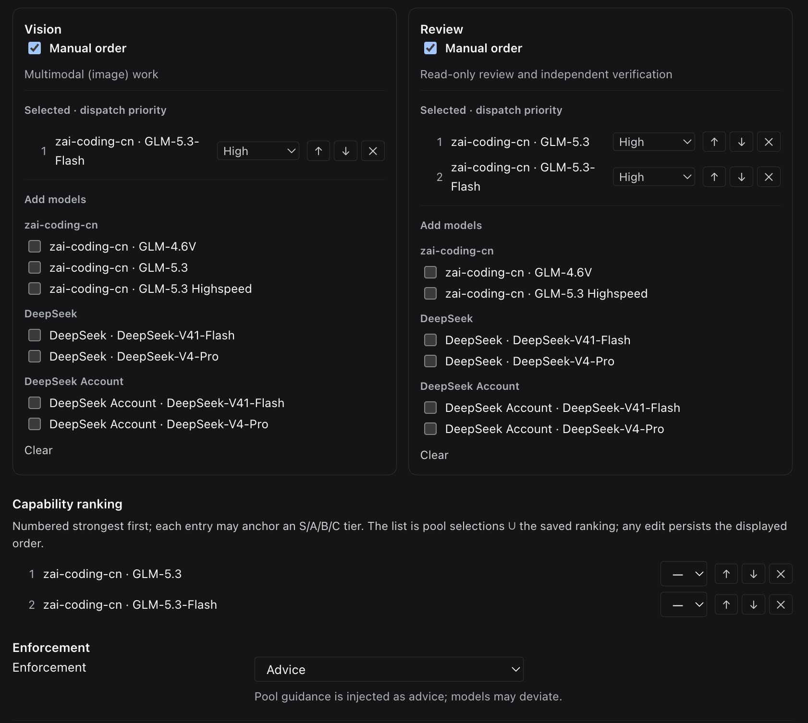
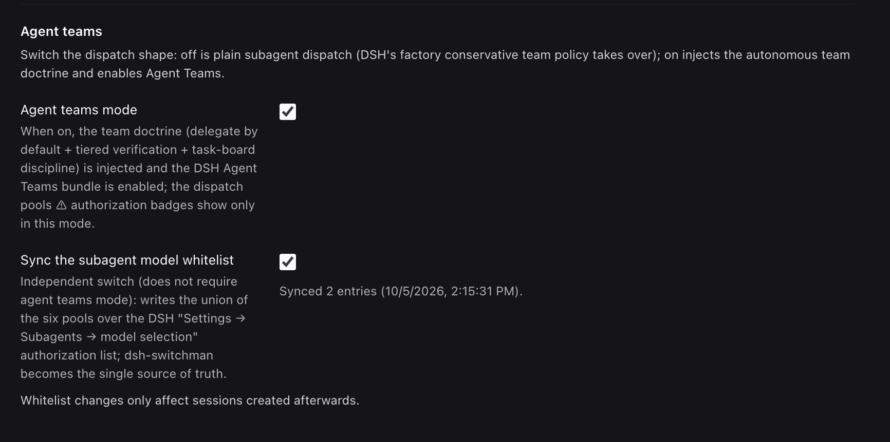
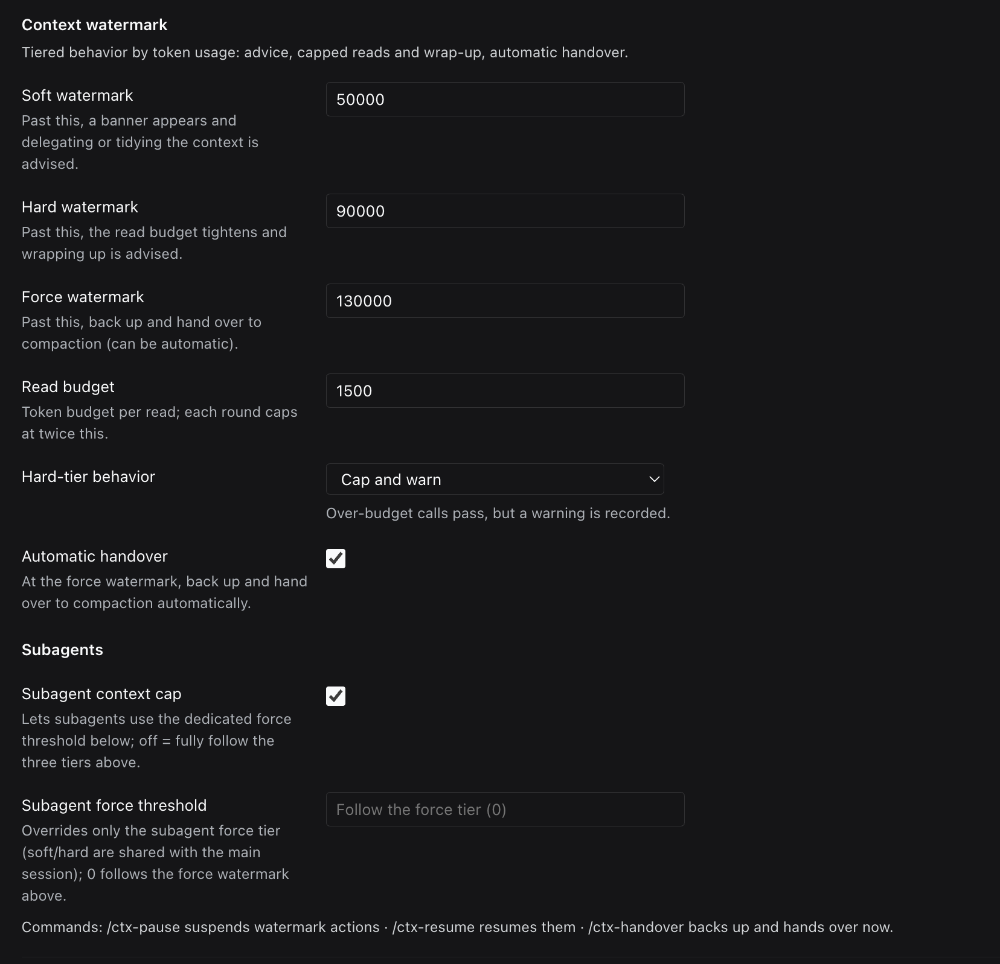

# dsh-switchman

**English** | [简体中文](./README.zh.md) | [繁體中文](./README.zh-TW.md) | [日本語](./README.ja.md) | [한국어](./README.ko.md) | [Español](./README.es.md) | [Français](./README.fr.md) | [Deutsch](./README.de.md) | [Italiano](./README.it.md) | [Português](./README.pt.md) | [Русский](./README.ru.md)

> **The switchman family**, same author, same orchestration: [opencode-switchman](https://github.com/mrzturn/opencode-switchman) (the OpenCode original) · [zcode-switchman](https://github.com/mrzturn/zcode-switchman) (the ZCode port) · **dsh-switchman** (this repo, the DeepSeek Harness edition).


> Meter the context, and every task finds its own lane.

## Why you need it

Work in DSH long enough and you run into two things:

1. **Sessions get heavier the longer they run.** History balloons the context to hundreds of thousands of tokens; the model starts forgetting, slowing down, getting expensive — until a manual /compact is your only option, and the moment it compresses, detail is lost.
2. **Your primary model does everything itself.** Looking up a file, running a test, reconciling data — it chews through all of it alone, slow and costly, when most of that work really belongs on a cheaper model.

dsh-switchman is a plugin for [DeepSeek Harness](https://github.com/deepseek-ai/deepseek-harness) (DSH). Once installed, the primary model goes from "doing everything itself" to working as a dispatcher: measure the water level, pick the lane, hand out the task, check the work. It is not a new model — it is an orchestration doctrine hooked onto DSH plus a settings page. Concretely, it does seven things:

**1. Context water level: long sessions never burst.** Every turn counts live session tokens against three water marks that ratchet up: 50k (soft, adjustable) nudges "time to delegate"; 90k (hard) tightens the per-read file budget and steers toward wrap-up; 130k (force) hands over automatically — forking a backup of the session, compacting the context, and waking the continuation, so the task never drops. Background subagents still running at that moment are not lost either: their ids, task descriptions, and report paths are written into the handover document, so the resumed session knows where to collect reports instead of dispatching duplicates. Every dispatched subagent carries its own hard cap; on reaching it, the subagent writes its HANDOFF summary and exits.

**2. Six dispatch pools: the right model for every job.** An economy pool (batch chores), a mechanical pool (templated rewrites), a main pool (day-to-day coding), a hard pool (tough reasoning and large-scale refactors), a vision pool (reading images), and a review pool (independent verification). In the settings page you tick candidates, rank them (optional S/A/B/C tiers), and pin a reasoning effort to each individual route — the effort dropdown lists the levels that model actually supports, not a generic three. Every prompt sent to the primary model carries a `[SWITCHMAN:POOLS]` recommendation table, and it dispatches by that table. Execution mode has three states: off / advice / enforce (enforce = out-of-pool models are rejected outright).

**3. Agent Teams mode: from working solo to running a team.** Off by default — right after install you get lightweight subagent dispatch. Two independent toggles live in the settings page:

- **Agent teams mode** — turning it on injects the team doctrine (delegate-by-default + tiered verification + shared-task-board discipline) and automatically enables DSH's Agent Teams: the primary model can pull in durable teammates (`spawn_teammate`), assign work on the shared task board (`team_task_*`), and trade messages with teammates (`send_message`). When to build a team follows a clear discipline: parallelizable independent subtasks, bulky self-contained work, a primary context already running high, or a need for role separation; one-off single-point investigations still go through a subagent. DSH's shipped policy is "no team unless the user names one" — here it flips to "use one when it fits". Turning the toggle off again leaves zero residue of the team clauses, and it never strips the team tools from sessions that are already running.
- **Subagent model whitelist sync** — DSH keeps an authorization whitelist of "models agents may pick for subagents": routes selected in a pool but never authorized get denied when the primary model names them explicitly (in teams mode, the pools table and the settings page flag those routes with ⚠). Flip this toggle and the union of all six pools is written into that whitelist wholesale — no configuring the same thing on both sides, switchman stays the single source of truth, and the fork-dispatch path is covered as well. The whitelist takes effect as a per-new-session snapshot, so the sync only applies to sessions opened afterwards.

The session header keeps you posted at a glance: an ⚡ "autonomous team" badge and a ◇ chip showing the session's actual model; while an automatic handover is running, a live "handover in progress · backing up session / compacting context / waking continuation" banner appears.

**4. Language preferences: asked once, remembered for good.** One dropdown each for replies, code comments, and documentation, with a scope of global or per project (`.switchman/lang.json`). Leaving them unset is fine — the first time it matters, you are asked once in your DSH UI's language, the answer is remembered, and every session afterwards follows it automatically.

**5. Interface language: the plugin speaks your language too.** A new top-most "Interface" section on the settings page holds an "Interface language" dropdown (setting key `uiLocale`): Auto (default — follows the DeepSeek Harness app language) or any of the languages the plugin's UI ships in, each shown by its endonym. It switches this plugin's own UI only — the header badge, the home panel, and the settings page — not the DSH app language; the preview is instant with no restart, Save persists the choice per profile, the next start restores it, every failure falls back to the app language, and all dictionaries are inlined in the bundle.

**6. Tiered verification: every change gets checked.** Changes over 20 lines go to a tester; over 300 lines, or anything touching core / security / data-consistency logic, also gets an independent reviewer pass. The reviewer's model is chosen to avoid the model used by "the agent that wrote the diff" — as far as the pools allow; when they truly cannot, the conclusion declares DOWNGRADED. Say "don't use teams" once and it instantly drops back to solo.

**7. `/vision`: text-only models can still work with images.** When your primary model cannot read images, DSH refuses image-bearing messages right at the gate. Attach the image, type `/vision what's wrong with this image`, and the image is resolved to a file path and handed to a vision-pool model to read, with the findings returned to the current session. A hint appears above the composer early on — "the current model can't read images"; when a plain image send is refused, the draft is rewritten once as `/vision` and resubmitted on its own, no manual redo; if no vision pool is configured, the command refuses with setup guidance.

Only one model? Still worth installing — water-level control and tiered verification do not care how many models you have, and long single-model sessions benefit all the same.

## Bundled skills

- **db-query** — read-only MySQL / Redis verification: run SQL to reconcile records, check cache keys / TTLs, and audit cross-store consistency; refuses all writes. One-time setup below.
- **git-commit-message** — generates convention-compliant commit text. Text only; it never runs git for you.
- **requirement-docs** — one spec for requirements analysis / PRD / design documents, with output archived to `docs/requirements-and-design/`.

## Quick start

1. **Install** — from any agent session, or the Web plugin manager:

   ```
   plugin_manager: install_bundle  target=dsh-switchman
   ```

   or from a local checkout (linked; re-run `remove_bundle` + `install_bundle` after pulling changes):

   ```
   plugin_manager: install_bundle  target=/path/to/dsh-switchman
   ```

   or from a terminal via the `dsh` CLI — pick the profile that matches how you run DSH:

   ```bash
   dsh plugin --profile web add dsh-switchman      # Web GUI
   dsh plugin --profile desktop add dsh-switchman   # desktop app
   ```

2. **Restart DSH** — quit the app entirely and reopen (a page reload is not enough) so the client-module table picks up the bundle.

3. **Language preferences** — Settings → dsh-switchman, or "Switchman Control Center" in the home sidebar. The first screen sets the scope: global (this profile) or per project (each project's `.switchman/lang.json`); then three dropdowns set the reply / comment / doc languages, each with a live "current: …" line underneath. Skipping is fine — you will be asked once on first use and remembered (the question is asked in your DSH UI language).

   

4. **Fill the dispatch pools** — each pool card lists candidate models grouped by provider; tick the ones you want. Tick "manual order" and the card becomes a numbered priority list you reorder with ↑ ↓ ×; next to each route you can also pin a reasoning effort (it defaults to "follow lane"; pinning it lists the levels that model actually supports). A summary line at the top tracks progress live, e.g. "6/6 pools set · 2 ranked · advice mode".

   

   The vision and review pools live below; further down sit **capability ranking** (the union of the models selected across the six pools — the index is the capability order, strongest first, with optional S/A/B/C tiers) and **execution mode** (advice / enforce).

   

5. **Agent teams** — both toggles are off by default; start with plain subagent dispatch. To let the model pull teams in on its own, turn on "agent teams mode"; to skip authorizing the same routes twice, turn on "subagent model whitelist sync" — a "synced N routes + time" status line under the toggle confirms what was written.

   

6. **Context water level** — the three thresholds (defaults 50000 / 90000 / 130000), the per-read budget, hard-mode behavior (throttled pass / block), the auto-handover toggle, and the subagent-specific cap all live in this section. The bottom line carries the commands: `/ctx-pause` to pause intervening · `/ctx-resume` to resume · `/ctx-handover` to back up and hand over now (it steers the session to an idle boundary and waits out the compaction retry window, so the result can take a few minutes).

   

7. **Verify** — an ⚡ "autonomous team" badge appears in the session header (with a ◇ beside it showing the current session model); or simply ask the model "what is the heading of the last section of your system prompt" — the answer should mention the dsh-switchman doctrine.

**db-query one-time setup** (script dependencies install inside the skill directory — your project stays clean):

```bash
bash <install-dir>/skills/db-query/scripts/setup.sh
```

## How it works

- The Host half (`index.js` + `host/`) injects the dynamic system-prompt sections (language / lanes / water level / teams), the read-budget and enforce gates, and four slash commands (the ctx trio + `/vision`). Save a setting and it applies to the next prompt assembly — no restart needed.
- The Client half (`client.js`) renders the settings page, the ⚡ badge and ◇ model chip in the session header, and the live handover-in-progress banner, through official settings-form services.
- The "Switchman Control Center" entry in the home sidebar opens the same configuration page (interface language, language preferences, dispatch pools & ranking, water level) as a central panel with one click; the original settings entry stays.
- `cordis.patch.yml` keeps the shipped preset plugin list verbatim and extends only the persona suffix; the Agent Teams tools themselves come from the shipped bundle and are enabled automatically when teams mode is turned on.

## Maintenance

- After a DSH upgrade that changes shipped preset plugin lists, re-sync `cordis.patch.yml` from the new `presets/*.patch.yml` (keep the doctrine suffix), then reinstall.
- Protocol lines (`[SWITCHMAN:LANG|POOLS|WATERMARK|TEAMS]`) are deliberately English and byte-stable — do not localize them.
- `npm pack --dry-run` must stay at the audited 50 files / ~205 kB shape (`docs/` screenshots never ship).

## License

MIT
