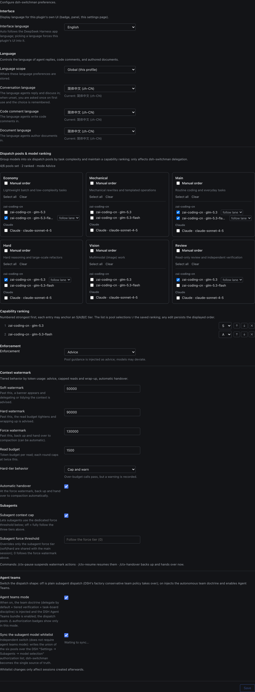

# dsh-switchman

**English** | [简体中文](./README.zh.md) | [繁體中文](./README.zh-TW.md) | [日本語](./README.ja.md) | [한국어](./README.ko.md) | [Español](./README.es.md) | [Français](./README.fr.md) | [Deutsch](./README.de.md) | [Italiano](./README.it.md) | [Português](./README.pt.md) | [Русский](./README.ru.md)

> **The switchman family**, same author, same dispatch doctrine: [opencode-switchman](https://github.com/mrzturn/opencode-switchman) (the OpenCode original) · [zcode-switchman](https://github.com/mrzturn/zcode-switchman) (the ZCode port) · **dsh-switchman** (this repo, the DeepSeek Harness edition).


> A water meter on the context; every task finds its own lane.

## Why you need it

Two pains creep in once you've worked in DSH for a while. First, sessions get heavier the longer they run: history bloats the context into hundreds of thousands of tokens, the model starts forgetting, slowing down, costing more — and a manual /compact loses detail. Second, the main model does everything itself: chasing files, running tests, reconciling data — most of that work belongs on a cheaper model.

dsh-switchman is a plugin for [DeepSeek Harness](https://github.com/deepseek-ai/deepseek-harness) (DSH). Once installed, the main model stops doing and starts dispatching: measure the watermark, pick a lane, hand out tasks, check acceptance. It's not a new model — it's a dispatch doctrine hooked onto DSH plus a settings page, and it does seven things:

**1. Context watermark: long sessions don't blow up.** Every turn counts session tokens in real time, and three escalating lines tighten the screws: 50k (soft, adjustable) nudges "time to delegate"; 90k (hard) shrinks the single-read budget and steers toward wrap-up; 130k (force) hands over automatically — forks the session for the record, compacts the context, wakes the fork to continue, task unbroken. Background subagents still running at handover aren't lost either: their ids, tasks, and report paths go into the handover document, so the resumed session knows where to collect reports and never dispatches twice. Every subagent carries its own hard cap and exits after writing its HANDOFF summary. When the automatic intervention doesn't suit you, take over manually: `/ctx-pause` stops all watermark actions (measurement keeps running, the banner switches to paused — it just stops acting), `/ctx-resume` restores them at any time — after a DSH restart the enforcement also comes back on its own, a temporary let-go, not a permanent off; `/ctx-handover` doesn't wait for the watermark to hit the ceiling and starts the same handover on demand: fork a backup, compact the context, wake the continuation (the session is first steered to an idle boundary, so the result can take a few minutes).

**2. Six dispatch pools: the right model for every job.** Economy (batch small chores), mechanical (template rewrites), main (day-to-day coding), hard (hard reasoning and large refactors), vision (images), review (independent verification). On the settings page you tick candidates, order priorities, grade S/A/B/C, and pin a per-route thinking effort — the effort dropdown lists the levels that model actually supports, not a generic three. Every turn's prompt carries a `[SWITCHMAN:POOLS]` recommendation table, and the main model dispatches by it. Three enforcement modes: off / advice / force (force = out-of-pool models get rejected outright).

**3. Agent Teams mode: from solo to a team.** Off by default — after install it's lightweight subagent dispatch. Two independent toggles on the settings page:

- **Agent teams** — once on, the team doctrine is injected (delegate by default + tiered verification + shared task-board discipline) and DSH's Agent Teams is enabled automatically: the main model can pull standing teammates (`spawn_teammate`), put work on a shared task board (`team_task_*`), and message teammates. When to form a team follows clear discipline: parallelizable independent subtasks, bulky self-contained work, high main-context watermark, need for role separation; one-off single-point investigations still go to a subagent. Turn the toggle off and the team clauses vanish without residue, and team tools are never yanked from sessions still running.
- **Subagent model whitelist sync** — DSH keeps an authorization whitelist "allow agents to pick models for subagents": routes chosen in a pool but not authorized get rejected when dispatched by name (marked ⚠ in teams mode). Flip this toggle and the union of all six pools is written into that whitelist wholesale — switchman becomes the single source of truth, no double configuration. The whitelist takes effect as a per-new-session snapshot; the sync only affects sessions started afterwards.

The session header gives at-a-glance feedback: the ⚡ "autonomous team" badge and ◇ with the session's actual model; while an auto-handover runs, a live indicator shows "handover in progress · backup session / compacting context / waking the successor".

**4. Language preferences: ask once, remember forever.** One dropdown each for replies, code comments, and documents; scope is global or per-project (`.switchman/lang.json`). Skipping is fine — on first use you're asked once in your DSH interface language, and every session obeys the answer afterwards.

**5. Interface language: the plugin itself speaks your language.** In the "Interface" section atop the settings page sits the "Interface language" dropdown (setting key `uiLocale`): Auto (default, follows the DeepSeek Harness app language), or any built-in interface language picked by hand — options always appear under the language's own endonym, never translated. It switches only the plugin's own interface (badge, home panel, settings page), never the DSH app language: selecting previews live with no restart, the choice is remembered after save and restored on the next launch, and any failure falls back to the app language; the dictionaries ship inline in the plugin bundle, nothing to download.

**6. Tiered verification: every change gets checked.** Changes over 20 lines go to a tester; over 300 lines, or touching core / security / data-consistency logic, additionally to an independent reviewer. The review model is picked anchored on the model of "the agent that wrote the diff", avoiding it where possible; when the pool can't, the conclusion declares DOWNGRADED. Say "don't use the team" once and it drops back to solo instantly.

**7. `/vision`: text-only models can still handle images.** When the main model can't read images, DSH rejects image-bearing messages at the gate. Paste the image, type `/vision what's wrong with this image`, and the image goes to a vision-pool model; the verdict comes back into the current session. A heads-up "current model can't read images" appears above the input box; when a direct image send is rejected, the message is rewritten as `/vision` and resent automatically — no manual redo; with no vision pool configured the command refuses and points to the settings.

Worth installing even with a single model — watermark control and tiered verification don't care how many models you have, and long single-model sessions benefit just the same.

## Bundled skills

- **db-query** — read-only MySQL / Redis verification: run SQL to reconcile data, inspect cache keys / TTL, cross-database consistency checks; every write refused. Needs one-time initialization before first use (see below).
- **git-commit-message** — generates disciplined commit messages; text only, never runs git for you.
- **requirement-docs** — the house standard for requirement analysis / PRD / design docs; output is archived to `docs/requirements-and-design/`.

## Quick start

1. **Install** — have an agent run it in any session, or use the Web plugin management page:

   ```
   plugin_manager: install_bundle  target=dsh-switchman
   ```

   Or install from a local checkout (link mode; after an update, `remove_bundle` + `install_bundle` again):

   ```
   plugin_manager: install_bundle  target=/path/to/dsh-switchman
   ```

   Or with the `dsh` CLI in a terminal — pick the profile matching how you run it:

   ```bash
   dsh plugin --profile web add dsh-switchman      # Web GUI
   dsh plugin --profile desktop add dsh-switchman   # desktop app
   ```

2. **Restart DSH** — quit the app completely and reopen it (a page refresh doesn't count); only then does the client module table recognize the bundle.

3. **Configure** — Settings → dsh-switchman, or "Switchman Dispatch Center" in the home sidebar. It's a single page of config and looks like this — walk it top to bottom and you're done:

   

   - **Interface** — the plugin's own UI language. The dropdown in the shot sits at English — a live preview of switching; the shipped default is Auto (follows the DSH app language). Picking a language flips the whole page on the spot and is remembered after save; switch back to Auto anytime.
   - **Languages** — the languages of agent output. The scope in the shot is "Global (this profile)" (per-project works too, each reading `.switchman/lang.json`); the reply / code comments / documents dropdowns in the shot all sit at English, each displayed as "endonym (tag)" — e.g. "English (en)" — with a "current: …" status line beneath each. Leaving all three unset is fine too: asked once on first use, remembered from then on.
   - **Dispatch pools** — six cards in two rows of three: economy, mechanical, main on top; hard, vision, review below. Tick candidate models grouped by provider; tick "manual order" and a card becomes a numbered priority list reorderable with ↑ ↓ ×; every route can pin a thinking effort (default "follow lane"). The summary line at the top updates live — in the shot: "4/6 pools configured · 2 ranked · mode advice".
   - **Capability ranking + enforcement mode** — the union of selected models across the six pools, ranked by capability, strongest first (the shot anchors glm-5.3 at S and glm-5.3-flash at A), reorderable and removable; enforcement mode advice / force (force = out-of-pool models rejected outright).
   - **Agent teams** — the two toggles for team mode and whitelist sync, both off by default; in the shot they're on, with a sync status line beneath the toggle.
   - **Context watermark** — the three thresholds (50000 / 90000 / 130000 in the shot), the single-read budget (1500), hard-tier behavior (throttle-pass / block), the auto-handover toggle, and subagent independent caps all live here. Bottom command row: `/ctx-pause` pause intervention · `/ctx-resume` resume · `/ctx-handover` back up and hand over now (it steers the session to an idle boundary before compacting — the result can take a few minutes).

4. **Verify** — the ⚡ "autonomous team" badge appears in the session header (with ◇ beside it showing the session's current model); or simply ask the model "what's the heading of the last section of your system prompt" — the answer should mention the dsh-switchman doctrine.

**db-query one-time initialization** (script dependencies install inside the skill directory, nothing pollutes your project):

```bash
bash <install-dir>/skills/db-query/scripts/setup.sh
```

## How it works

- The host half (`index.js` + `host/`) injects the dynamic system-prompt sections (language / lanes / watermark / teams), the read-budget plus enforce double gate, and four slash commands (the ctx trio + `/vision`). A saved setting takes effect at the very next prompt assembly — no restart.
- The client half (`client.js`) renders the settings page, the ⚡ badge and ◇ model marker in the session header, and the live handover indicator; config snapshots are read and written through the Host route family.
- The "Switchman Dispatch Center" entry in the home sidebar opens that same settings page as a center panel in one click; the original settings entry stays.
- `cordis.patch.yml` keeps the factory preset plugin list fully intact and only extends the persona suffix; the Agent Teams tools themselves come from the factory bundle and switch on automatically with teams mode.

## Maintenance notes

- After a DSH upgrade, if the factory preset plugin list changed, re-sync `cordis.patch.yml` from the new `presets/*.patch.yml` (keeping the doctrine suffix), then reinstall.
- Protocol lines (`[SWITCHMAN:LANG|POOLS|WATERMARK|TEAMS]`) are deliberately English and byte-stable — don't localize them.
- `npm pack --dry-run` should keep the audited 50-file / ~205 kB shape (`docs/` screenshots stay out of the package).

## License

MIT
