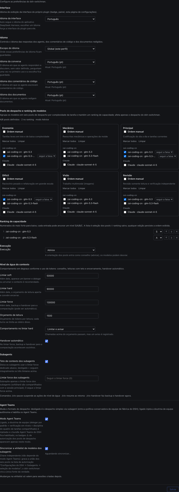

# dsh-switchman

[English](./README.md) | [简体中文](./README.zh.md) | [繁體中文](./README.zh-TW.md) | [日本語](./README.ja.md) | [한국어](./README.ko.md) | [Español](./README.es.md) | [Français](./README.fr.md) | [Deutsch](./README.de.md) | [Italiano](./README.it.md) | **Português** | [Русский](./README.ru.md)

> **A família switchman**, mesmo autor, mesma orquestração: [opencode-switchman](https://github.com/mrzturn/opencode-switchman) (o original para OpenCode) · [zcode-switchman](https://github.com/mrzturn/zcode-switchman) (o port para ZCode) · **dsh-switchman** (este repositório, a edição DeepSeek Harness).


> Contexto no medidor: cada tarefa encontra sozinha a faixa certa.

## Por que você precisa disso

Se você trabalha com o DSH, com o tempo esbarra em duas coisas: a sessão fica cada vez mais pesada — o histórico empurra o contexto para centenas de milhares de tokens, o modelo começa a esquecer, fica lento e caro, e o /compact manual compacta perdendo detalhes no processo; e o modelo principal faz tudo sozinho — consultar um arquivo, rodar um teste, conferir dados: é sempre ele que mastiga tudo, lento e caro, sendo que a maior parte desse trabalho caberia a um modelo barato.

dsh-switchman é um plugin para o [DeepSeek Harness](https://github.com/deepseek-ai/deepseek-harness) (DSH). Depois de instalado, o modelo principal deixa de “fazer tudo sozinho” e vira um dispatcher: mede o nível de água, escolhe a faixa, entrega as tarefas, confere o resultado. Não é um modelo novo: é um regulamento de despacho plugado ao DSH mais uma interface de configuração. Em concreto, ele faz sete coisas:

**1. Nível de água do contexto: sessões longas não estouram.** A cada turno ele conta os tokens da sessão em tempo real, e três limiares apertam em degraus: 50k (soft, ajustável) lembra que “é hora de delegar”; 90k (hard) aperta o orçamento de leitura por chamada e empurra para encerrar; 130k (force) dispara o handover automático — fork da sessão como cópia de segurança, contexto compactado, continuação despertada: a tarefa não cai no meio. Nem os subagents em segundo plano que ainda estiverem rodando no momento da entrega se perdem: id, descrição da tarefa e caminho do relatório vão para o documento de handover, e a sessão retomada sabe onde coletar os relatórios em vez de despachar o mesmo trabalho de novo. Cada subagent enviado carrega um teto próprio e independente e, ao atingi-lo, sai depois de escrever o resumo HANDOFF.

**2. Seis pools de despacho: a cada trabalho, o seu modelo.** Pool leve (economy, trabalho pequeno em lote), pool mecânico (mechanical, reescritas de molde), pool principal (main, codificação do dia a dia), pool difícil (hard, raciocínio pesado e refatoração em grande escala), pool multimodal (vision, leitura de imagens), pool de revisão (review, verificação independente). Na página de configurações você marca os candidatos, ordena as prioridades (com níveis opcionais S/A/B/C) e fixa um reasoning effort por rota — o dropdown lista os níveis que aquele modelo realmente suporta, não três níveis genéricos. A cada turno, o prompt do modelo principal carrega uma tabela de recomendações `[SWITCHMAN:POOLS]`: o trabalho é despachado seguindo a tabela. O modo de execução tem três estados: off / advice / enforce (enforce = modelos fora do pool são recusados na hora).

**3. Modo Agent Teams: do trabalho solo para comandar uma equipe.** Desligado por padrão: recém-instalado, o trabalho corre no despacho leve via subagent. Na página de configurações, duas chaves independentes:

- **Modo Agent Teams** — ao ligar, injeta a doutrina de equipe (delegar por padrão + verificação em níveis + disciplina do quadro de tarefas compartilhado) e habilita automaticamente os Agent Teams do DSH: o modelo principal pode recrutar colegas permanentes (`spawn_teammate`), despachar trabalho para o quadro compartilhado (`team_task_*`) e trocar mensagens com eles. Há uma disciplina clara sobre quando formar a equipe: subtarefas independentes paralelizáveis, trabalho volumoso e autossuficiente, nível de água do contexto principal já alto, necessidade de separar papéis; investigações pontuais de uma vez só continuam pelo subagent. Desligando a chave de novo, as cláusulas de equipe somem sem resíduo, e as ferramentas de equipe nas sessões em andamento não são recolhidas.
- **Sincronização da whitelist de modelos de subagent** — o DSH tem uma whitelist de autorização “Permitir que os agents escolham modelos para os subagents”: rotas escolhidas nos pools mas não autorizadas são recusadas quando o modelo principal as nomeia explicitamente (no modo equipe, são marcadas com ⚠). Com esta chave ligada, a união dos seis pools é gravada de uma vez nessa whitelist — sem configurar dos dois lados: o switchman é a única fonte da verdade. A whitelist vale como snapshot por “nova sessão”: a sincronização só alcança as sessões abertas depois.

O cabeçalho da sessão dá um retorno imediato: badge ⚡ “Equipe autônoma”, ◇ modelo em uso na sessão atual; durante um handover automático aparece um aviso em tempo real do tipo “Handover em andamento · backup da sessão / compactação do contexto / despertar da continuação”.

**4. Preferências de idioma: pergunta uma vez, lembra para sempre.** Um dropdown para cada um dos três idiomas — respostas, comentários de código, documentos — com escopo à escolha: global ou por projeto (`.switchman/lang.json`). Pode deixar em branco: no primeiro uso perguntam uma vez, no idioma da interface do DSH, e daí em diante toda sessão segue sozinha.

**5. Idioma da interface: o plugin também fala o seu idioma.** No topo da página de configurações entra uma nova seção “Interface” com um dropdown “Idioma da interface” (chave de configuração `uiLocale`): Automático (padrão — segue o idioma do app DeepSeek Harness) ou qualquer um dos idiomas da interface do plugin, sempre pelo endônimo, nunca traduzido. Ele troca só a interface do próprio plugin — o badge do cabeçalho, o painel da página inicial e a página de configurações —, não o idioma do app DSH: a prévia é imediata, sem reinício; ao salvar, a escolha fica guardada; o próximo início a restaura; qualquer falha volta ao idioma do app; e todos os dicionários vêm dentro do bundle, sem download.

**6. Verificação em níveis: mudou, testa.** Alterações acima de 20 linhas vão para um tester validar; acima de 300 linhas, ou quando tocam lógica central / segurança / consistência de dados, entra também um reviewer com revisão independente. O modelo do reviewer é escolhido ancorando no modelo do “agent que escreveu o diff”, evitando-o sempre que possível; se no pool não dá para evitá-lo, a conclusão declara DOWNGRADED. Basta dizer “não use equipes” e ele volta na hora a trabalhar sozinho.

**7. `/vision`: até modelo somente texto lida com imagens.** Quando o modelo principal não sabe ler imagens, o DSH recusa na entrada as mensagens que as trazem. Você anexa a imagem e digita `/vision onde está o erro nesta imagem`: a imagem é entregue à leitura de um modelo do pool multimodal, e a conclusão volta para a sessão atual. Acima da caixa de entrada aparece antes o aviso “o modelo atual não suporta leitura de imagens”; se um envio direto da imagem for recusado, a mensagem é reescrita uma vez para `/vision` e reenviada sozinha, sem precisar refazer à mão; sem pool multimodal configurado, o comando recusa e indica como configurar.

Só um modelo? Ainda vale a pena instalar — o controle do nível de água e a verificação em níveis não ligam para quantos modelos você tem, e sessões longas de modelo único se beneficiam do mesmo jeito.

## Skills embutidas

- **db-query** — verificação somente leitura em MySQL/Redis: rode SQL para checar registros, chaves de cache / TTLs, consistência entre stores. Recusa qualquer escrita. Inicialização no primeiro uso (veja abaixo).
- **git-commit-message** — texto de commit dentro das convenções. Só texto; nunca toca no git.
- **requirement-docs** — uma especificação única para requisitos / PRD / documentos de design, arquivada em `docs/requirements-and-design/`.

## Início rápido

1. **Instale** — de qualquer sessão de agent, ou pelo gerenciador de plugins Web:

   ```
   plugin_manager: install_bundle  target=dsh-switchman
   ```

   ou de um checkout local (link; rode `remove_bundle` + `install_bundle` novamente depois de puxar as mudanças):

   ```
   plugin_manager: install_bundle  target=/path/to/dsh-switchman
   ```

   ou pelo terminal via CLI `dsh` — escolha o perfil que corresponde a como você executa o DSH:

   ```bash
   dsh plugin --profile web add dsh-switchman      # Web GUI
   dsh plugin --profile desktop add dsh-switchman   # app desktop
   ```

2. **Reinicie o DSH** — feche o app por completo e reabra (recarregar a página não basta), para que a tabela de módulos do cliente reconheça o bundle.

3. **Configure** — Configurações → dsh-switchman, ou a entrada “Switchman Control Center” na barra lateral da página inicial. A configuração cabe numa página só; ela é esta — um passeio de cima a baixo e está pronto:

   

   - **Interface** — o idioma da interface do próprio plugin. Na captura está selecionado “Português”: é a prévia imediata, a página inteira troca na hora; por padrão fica “Automático”, que segue o idioma do app DSH. A escolha fica guardada ao salvar, e dá para voltar a “Automático” a qualquer momento.
   - **Idioma** — o idioma do que o agente produz. O escopo na captura é “Global (este perfil)” (dá para ser por projeto também, cada um lê o próprio `.switchman/lang.json`); os três dropdowns de respostas / comentários de código / documentos estão todos fixados em “Português (pt)”, cada um com uma linha de status “Atual: …” embaixo. Pode deixar tudo em branco: no primeiro uso perguntam uma vez e fica guardado.
   - **Pools de despacho** — seis cards em duas fileiras de três: em cima leve / mecânico / principal; embaixo difícil / multimodal / revisão. Em cada card você marca os candidatos agrupados por provider; marque “ordem manual” e ele vira uma lista de prioridade numerada, reordenável com ↑ ↓ ×; ao lado de cada rota dá para fixar o reasoning effort (padrão “seguir a faixa”). A linha de resumo no topo se atualiza em tempo real; na captura: “4/6 pools configurados · 2 no ranking · modo advice”.
   - **Ranking de capacidade + modo de execução** — a união dos modelos escolhidos nos seis pools, ordenada por capacidade com os mais fortes na frente (na captura glm-5.3 ancorado em S e glm-5.3-flash ancorado em A); dá para reordenar e cortar; o modo de execução vai de advice / enforce (enforce = modelos fora do pool são recusados na hora).
   - **Equipe de agentes** — as duas chaves, modo equipe e sincronização da whitelist, começam desligadas; na captura estão ligadas, e abaixo de cada uma há uma linha de status de sincronização.
   - **Nível de água do contexto** — os três limiares (na captura 50000 / 90000 / 130000), o orçamento de leitura por chamada (1500), o comportamento do limiar hard (deixa passar com limitação / bloqueia), a chave do handover automático e o teto independente dos subagents ficam todos nesta área. Uma linha de comandos embaixo: `/ctx-pause` pausa as intervenções · `/ctx-resume` retoma · `/ctx-handover` faz backup e entrega na hora (ele conduz a sessão até o limite de inatividade antes de compactar: o resultado pode levar alguns minutos).

4. **Verifique** — no cabeçalho da sessão aparece o badge ⚡ “Equipe autônoma” (ao lado, o ◇ mostra o modelo da sessão atual); ou pergunte direto ao modelo “qual é o título da última seção do seu system prompt?” — a resposta deve mencionar a doutrina dsh-switchman.

**Inicialização do db-query no primeiro uso** (as dependências dos scripts vivem dentro do diretório da skill, sem sujar o projeto):

```bash
bash <install-dir>/skills/db-query/scripts/setup.sh
```

## Como funciona

- A metade Host (`index.js` + `host/`) injeta as seções dinâmicas do system prompt (idiomas / faixas / nível de água / equipe), a dupla trava de orçamento de leitura + enforce e os quatro comandos slash (o trio ctx mais `/vision`). Toda configuração salva já vale na montagem do prompt seguinte, sem reinício.
- A metade Client (`client.js`) renderiza a página de configurações, o badge ⚡ e o identificador ◇ do modelo no cabeçalho da sessão e o aviso dinâmico durante o handover; os snapshots de configuração são lidos e gravados pela família de rotas Host.
- A entrada “Switchman Control Center” na barra lateral da página inicial abre com um clique esta mesma página de configuração como painel central; a entrada nas configurações permanece.
- `cordis.patch.yml` conserva integralmente a lista de plugins dos presets de fábrica e intervém só no persona suffix; as ferramentas Agent Teams em si vêm do bundle de fábrica e são habilitadas automaticamente ao ligar o modo equipe.

## Manutenção

- Depois de um upgrade do DSH que mude a lista de plugins dos presets de fábrica, ressincronize `cordis.patch.yml` a partir dos novos `presets/*.patch.yml` (mantenha o doctrine suffix) e reinstale.
- As linhas de protocolo (`[SWITCHMAN:LANG|POOLS|WATERMARK|TEAMS]`) ficam deliberadamente em inglês e estáveis a byte — não as localize.
- `npm pack --dry-run` deve continuar na forma auditada de 50 arquivos / ~205 kB (os screenshots de `docs/` não vão no pacote).

## License

MIT
