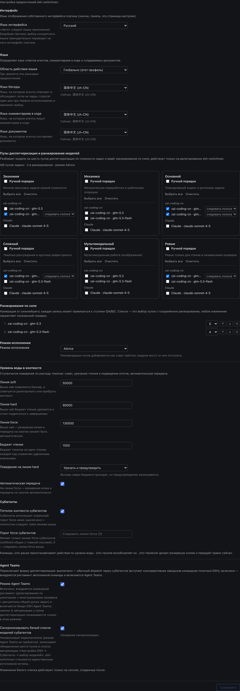

# dsh-switchman

[English](./README.md) | [简体中文](./README.zh.md) | [繁體中文](./README.zh-TW.md) | [日本語](./README.ja.md) | [한국어](./README.ko.md) | [Español](./README.es.md) | [Français](./README.fr.md) | [Deutsch](./README.de.md) | [Italiano](./README.it.md) | [Português](./README.pt.md) | **Русский**

> **Семейство switchman**, один автор, одна и та же философия диспетчеризации: [opencode-switchman](https://github.com/mrzturn/opencode-switchman) (оригинал для OpenCode) · [zcode-switchman](https://github.com/mrzturn/zcode-switchman) (порт для ZCode) · **dsh-switchman** (этот репозиторий, версия для DeepSeek Harness).


> Контекст под счётчиком. Задачи сами находят свою полосу.

## Зачем это нужно

Если работать в DSH подольше, рано или поздно упираешься в две вещи: сессия тяжелеет с каждым сообщением — история раздувает контекст до сотен тысяч токенов, модель начинает забывать, тормозить и дорожать, а ручной /compact при каждом сжатии ещё и теряет детали; и главная модель всё делает сама — прочитать файл, прогнать тест, сверить данные: всё она грызёт сама, медленно и дорого, хотя большая часть этой работы по праву досталась бы дешёвой модели.

dsh-switchman — плагин для [DeepSeek Harness](https://github.com/deepseek-ai/deepseek-harness) (DSH). После установки главная модель перестаёт «делать всё сама» и становится диспетчером: замеряет уровень воды, выбирает полосу, раздаёт задачи, принимает работу. Это не новая модель, а свод правил диспетчеризации, пристёгнутый к DSH, плюс страница настроек. Конкретно он делает семь вещей:

**1. Уровень воды в контексте: длинная сессия не переполняется.** Каждый ход подсчитывает токены сессии в реальном времени, и три линии уровня ужесточаются по нарастающей: 50k (soft, настраивается) подсказывает «пора делегировать»; 90k (hard) урезает бюджет разового чтения и подталкивает к завершению; 130k (force) запускает автоматическую передачу — форкает копию сессии в архив, сжимает контекст и будит продолжение, работа не обрывается. Фоновые субагенты, которые ещё бегут в момент передачи, тоже не теряются: id, описания задач и пути к отчётам записываются в документ передачи, и продолжившаяся сессия знает, куда идти за отчётами, а не раздаёт работу заново. У каждого отправленного субагента свой жёсткий потолок: доработав до него, он завершается резюме HANDOFF.

**2. Шесть пулов диспетчеризации: под каждую работу — своя модель.** Лёгкий пул (economy — мелкие массовые задачи), механический (mechanical — шаблонные переработки), основной (main — повседневный кодинг), пул высокой сложности (hard — тяжёлые рассуждения и крупные рефакторинги), мультимодальный (vision — чтение картинок), пул ревью (review — независимая проверка). На странице настроек отмечаете кандидатов, расставляете приоритеты (можно с привязкой к ступеням S/A/B/C) и для каждого маршрута отдельно фиксируете reasoning effort — выпадающий список ступеней берётся из уровней, которые модель реально поддерживает, а не из трёх универсальных. Каждый ход промпт главной модели несёт с собой таблицу рекомендаций `[SWITCHMAN:POOLS]`, и работа раздаётся по ней. У режима исполнения три состояния: off / advice / enforce (enforce = модель вне пула просто отклоняется).

**3. Режим Agent Teams: от работы в одиночку — к своей команде.** По умолчанию выключен: сразу после установки это просто лёгкая диспетчеризация через subagent. На странице настроек два независимых переключателя:

- **Режим команды агентов** — при включении внедряет командный регламент (делегирование по умолчанию + многоуровневая проверка + дисциплина общей доски задач) и автоматически включает Agent Teams в DSH: главная модель может нанимать постоянных товарищей по команде (`spawn_teammate`), ставить им задачи на общей доске (`team_task_*`) и обмениваться с ними сообщениями. Когда заводить команду, решает чёткая дисциплина: параллельные независимые подзадачи, объёмная самодостаточная работа, уже высокий уровень воды в главном контексте, потребность разделить роли; разовая точечная разведка по-прежнему идёт через subagent. Если выключить переключатель обратно, от командных пунктов не останется и следа, а инструменты команды из уже работающих сессий не изымаются.
- **Синхронизация белого списка моделей субагентов** — в DSH есть белый список авторизации «разрешить агентам выбирать модели для субагентов»: если маршрут выбран в пуле, но не авторизован, явное назначение его главной моделью будет отклонено (в командном режиме он помечается ⚠). Включите этот переключатель — и объединение шести пулов целиком запишется в белый список: настраивать дважды не нужно, switchman остаётся единственным источником истины. Белый список применяется по снимку «новая сессия»: синхронизация действует только на сессии, открытые после неё.

В шапке сессии — наглядная обратная связь: значок ⚡ «автономная команда», ◇ с фактической моделью текущей сессии; когда идёт автоматическая передача, появляется живая подсказка «идёт передача · резервная сессия / сжатие контекста / пробуждение продолжения».

**4. Языковые предпочтения: спросит один раз — запомнит навсегда.** Три выпадающих списка: язык ответов, комментариев в коде и документов; область действия — глобальная или по проекту (`.switchman/lang.json`). Настраивать не обязательно: при первом использовании спросят один раз — на языке интерфейса вашего DSH — и запомнят; дальше каждая сессия соблюдает выбор автоматически.

**5. Язык интерфейса: плагин говорит и на вашем языке.** В самом верху страницы настроек появился раздел «Интерфейс» с выпадающим списком «Язык интерфейса» (ключ настройки `uiLocale`): «Авто» (по умолчанию — следует языку приложения DeepSeek Harness) или любой из языков интерфейса плагина, всегда под своим эндонимом, без перевода. Переключается только интерфейс самого плагина — значок в шапке, панель главной страницы и страница настроек, — но не язык приложения DSH: предпросмотр мгновенный, без перезапуска; сохранение запоминает выбор; следующий запуск восстанавливает его; любой сбой возвращает язык приложения; а все словари лежат внутри бандла — ничего скачивать не нужно.

**6. Многоуровневая проверка: изменено — проверено.** Изменения больше 20 строк уходят тестировщику на проверку; изменения больше 300 строк или затрагивающие ядро / безопасность / согласованность данных — дополнительно независимому ревьюеру. Модель ревьюера подбирают, привязываясь к модели агента, написавшего этот diff, и стараются её обойти; если пул другого выхода не оставляет, в заключении прямо заявляется DOWNGRADED. Скажете «не использовать команду» — всё мгновенно вернётся к одиночной работе.

**7. `/vision`: картинки по зубам даже чисто текстовой модели.** Когда главная модель не читает изображения, DSH прямо на входе отклоняет сообщения с картинками. Прикрепите картинку и введите `/vision что не так на этой картинке` — изображение будет отдано на чтение модели из мультимодального пула, а вывод вернётся в текущую сессию. Над полем ввода заранее подсказывают: «текущая модель не умеет читать изображения»; если прямая отправка картинки отклонена, она один раз автоматически переоформляется в `/vision` и уходит повторно — вручную ничего переписывать не нужно; если мультимодальный пул не настроен, команда откажется и подскажет, что настроить.

Всего одна модель? Всё равно стоит поставить — контроль уровня воды и многоуровневая проверка от числа моделей не зависят, и длинная сессия на одной модели выигрывает от них ничуть не меньше.

## Встроенные навыки

- **db-query** — верификация MySQL / Redis только на чтение: выполнить SQL для сверки данных, проверить ключи кэша / TTL и согласованность между хранилищами; любую запись отклоняет. При первом использовании нужна инициализация (см. ниже).
- **git-commit-message** — генерирует выдержанный в конвенциях текст коммита: только текст, git за вас не трогает.
- **requirement-docs** — единая спецификация для анализа требований / PRD / проектных документов; результаты архивируются в `docs/requirements-and-design/`.

## Быстрый старт

1. **Установите** — попросите agent выполнить установку в любой сессии, или откройте веб-страницу управления плагинами:

   ```
   plugin_manager: install_bundle  target=dsh-switchman
   ```

   или установите из локального checkout'а (режим link; после обновления нужно переустановить: `remove_bundle` + `install_bundle`):

   ```
   plugin_manager: install_bundle  target=/path/to/dsh-switchman
   ```

   или установите из терминала командой `dsh` — профиль выбирайте по способу запуска:

   ```bash
   dsh plugin --profile web add dsh-switchman      # Web GUI
   dsh plugin --profile desktop add dsh-switchman   # десктоп-приложение
   ```

2. **Перезапустите DSH** — полностью закройте приложение и откройте снова (перезагрузка страницы не считается) — только тогда таблица клиентских модулей распознает этот bundle.

3. **Настройте** — Настройки → dsh-switchman, или пункт «Диспетчерская Switchman» в боковой панели главной страницы. Вся конфигурация умещается на одной странице; вот она — проход сверху вниз, и всё готово:

   

   - **Интерфейс** — язык интерфейса самого плагина. На снимке выбран «Русский»: это мгновенный предпросмотр, вся страница переключается на месте; по умолчанию стоит «Авто» — следует языку приложения DSH. Выбор запоминается при сохранении, вернуться к «Авто» можно в любой момент.
   - **Язык** — язык того, что производит агент. Область действия на снимке — «Глобально (этот profile)» (можно и по проектам, каждый читает свой `.switchman/lang.json`); три выпадающих списка — ответы / комментарии в коде / документы — на снимке стоят на «Русский (ru)», под каждым строка состояния «сейчас: …». Можно не настраивать ничего: при первом использовании спросят один раз и запомнят.
   - **Пулы диспетчеризации** — шесть карточек в два ряда по три: сверху лёгкий / механический / основной; снизу высокосложный / мультимодальный / рецензентский. На каждой карточке отмечаются кандидаты, сгруппированные по поставщикам; отметьте «ручной порядок» — карточка станет нумерованным списком приоритетов, порядок меняется кнопками ↑ ↓ ×; рядом с каждым маршрутом можно зафиксировать reasoning effort (по умолчанию «следовать полосе»). Сводная строка сверху обновляется в реальном времени; на снимке: «пулов настроено: 4/6 · позиций в рейтинге: 2 · режим advice».
   - **Рейтинг по способностям + режим исполнения** — объединение моделей, выбранных в шести пулах, отсортировано по способности, сильнейшие впереди (на снимке glm-5.3 закреплён на ступени S, glm-5.3-flash — на A); порядок можно менять, лишние убирать; режим исполнения — advice / enforce (enforce = модель вне пула просто отклоняется).
   - **Команда агентов** — оба переключателя, командный режим и синхронизация белого списка, по умолчанию выключены; на снимке включены, под каждым — строка состояния синхронизации.
   - **Уровень воды в контексте** — три порога (на снимке 50000 / 90000 / 130000), бюджет разового чтения (1500), поведение жёсткого порога (пропустить с ограничением / заблокировать), переключатель автоматической передачи и отдельный потолок для субагентов — всё в этом разделе. Внизу строка команд: `/ctx-pause` приостановить вмешательство · `/ctx-resume` возобновить · `/ctx-handover` сделать резервную копию и передать управление прямо сейчас (команда подводит сессию к границе простоя и только потом сжимает контекст, результат может занять несколько минут).

4. **Проверьте** — в шапке сессии появился значок ⚡ «автономная команда» (рядом ◇ показывает модель текущей сессии); либо спросите модель напрямую: «как называется последний раздел твоего системного промпта?» — в ответе должен прозвучать регламент dsh-switchman.

**Инициализация db-query при первом использовании** (зависимости скриптов ставятся внутрь каталога навыка и не засоряют проект):

```bash
bash <install-dir>/skills/db-query/scripts/setup.sh
```

## Как это работает

- Host-половина (`index.js` + `host/`) внедряет динамические секции системного промпта (язык / полосы / уровень воды / команда), двойной шлюз бюджета чтения и enforce и четыре слэш-команды (ctx-тройка + `/vision`). Все настройки после сохранения вступают в силу при следующей сборке промпта — без перезапуска.
- Client-половина (`client.js`) отрисовывает страницу настроек, значок ⚡ и метку модели ◇ в шапке сессии, живую подсказку во время передачи управления; снимки конфигурации читаются и записываются через семейство маршрутов Host.
- Пункт «Диспетчерская Switchman» в боковой панели главной страницы: один клик открывает эту же страницу настроек в виде центральной панели; прежний вход в настройки остаётся на месте.
- `cordis.patch.yml` целиком сохраняет список плагинов заводских пресетов и расширяет только persona suffix; сами инструменты Agent Teams приходят из заводского bundle и автоматически включаются вместе с командным режимом.

## Обслуживание

- Если после обновления DSH изменился список плагинов заводских пресетов, пересинхронизируйте `cordis.patch.yml` из новых `presets/*.patch.yml` (сохранив doctrine suffix) и переустановите.
- Строки протокола (`[SWITCHMAN:LANG|POOLS|WATERMARK|TEAMS]`) намеренно оставлены на английском и стабильны побайтово — не локализуйте их.
- `npm pack --dry-run` должен сохранять аудированную форму: 50 файлов / ~205 kB (скриншоты из `docs/` в пакет не входят).

## License

MIT
