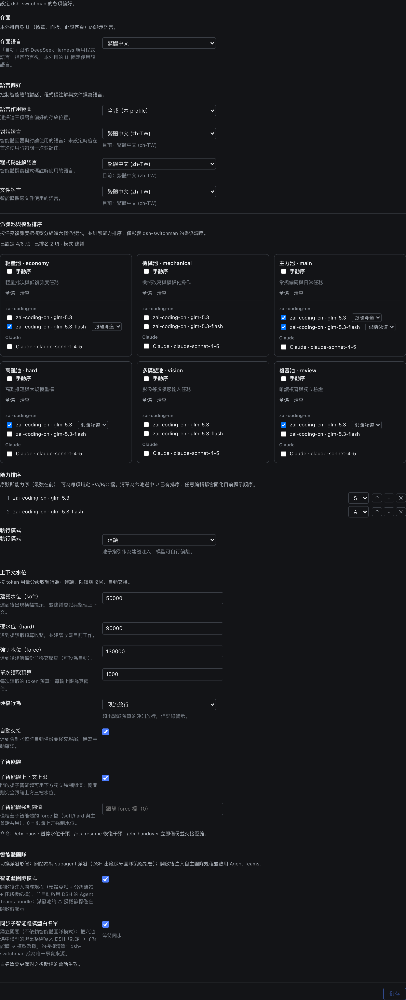

# dsh-switchman

[English](./README.md) | [简体中文](./README.zh.md) | **繁體中文** | [日本語](./README.ja.md) | [한국어](./README.ko.md) | [Español](./README.es.md) | [Français](./README.fr.md) | [Deutsch](./README.de.md) | [Italiano](./README.it.md) | [Português](./README.pt.md) | [Русский](./README.ru.md)

> **switchman 家族**，同一作者、同一套調度理念：[opencode-switchman](https://github.com/mrzturn/opencode-switchman)（OpenCode 原版）· [zcode-switchman](https://github.com/mrzturn/zcode-switchman)（ZCode 移植）· **dsh-switchman**（本儲存庫，DeepSeek Harness 版）。


> 上下文裝上水錶，任務自己找車道。

## 為什麼需要它

用 DSH 幹活久了有兩件煩心事：一是對話越聊越重，上下文被歷史撐到幾十萬 token，模型開始忘事、變慢、變貴，手動 /compact 又丟細節；二是主力模型什麼都自己幹，查個檔案、跑個測試、對個資料都是它在啃，大半活其實該交給便宜模型。

dsh-switchman 是一個 [DeepSeek Harness](https://github.com/deepseek-ai/deepseek-harness)（DSH）外掛。裝上之後，主模型從「親自幹活」變成調度員：量水位、選車道、派任務、盯驗收。它不是新模型，是一套掛在 DSH 上的調度規程加一個設定頁，一共做七件事：

**1. 上下文水位：長對話不撐爆。** 每輪即時統計對話 token，三條水位線逐級加碼：50k（soft，可調）提醒「該委派了」；90k（hard）收緊單次讀取預算、引導收尾；130k（force）自動交接——fork 一份對話留底、壓縮上下文、喚醒續跑，任務不斷線。交接那一刻還在跑的背景子代理也不會丟：id、任務、報告路徑都寫進交接文件，續跑的對話知道去哪收報告，不會重複派工。每個子代理自帶獨立硬上限，到頂寫完 HANDOFF 摘要退場。自動干預不合手時可臨時接管：`/ctx-pause` 停掉全部水位動作（量測照跑、橫幅轉成 paused，只是不動手），`/ctx-resume` 隨時恢復——重新啟動 DSH 後干預也會自動回來，是臨時放手，不是永久關閉；`/ctx-handover` 不等水位到頂，主動發起同一次交接：fork 備份、壓縮上下文、喚醒續跑（對話先被引導到閒置邊界，結果可能要等幾分鐘）。

**2. 六個派發池：什麼活配什麼模型。** 輕量池（批次小活）、機械池（模板化改寫）、主力池（日常編碼）、高難池（高難推理與大規模重構）、多模態池（看圖）、複審池（獨立驗證）。設定頁裡勾候選、排優先順序、標 S/A/B/C 級，還能給每條路線單獨釘選思考強度——強度下拉來自該模型真實支援的級別，不是通用三級。主模型每輪提示詞裡都帶著一張 `[SWITCHMAN:POOLS]` 推薦表，照表派工。執行模式三態：關閉 / 建議 / 強制（強制 = 池外模型直接拒絕）。

**3. Agent Teams 模式：從單幹到帶團隊。** 預設關閉，裝完就是輕量的 subagent 派發。設定頁兩個獨立開關：

- **代理團隊模式**——打開後注入團隊規程（預設委派 + 分級驗證 + 共享任務板紀律），並自動啟用 DSH 的 Agent Teams：主模型可以拉常駐隊友（`spawn_teammate`）、往共享任務板派工（`team_task_*`）、和隊友互傳訊息。什麼時候組團隊有明確紀律：可並行的獨立子任務、量大且自包含、主上下文水位已高、需要角色分離；一次性的單點調查仍走 subagent。再關掉開關，團隊條款零殘留，也不會撤走正在執行的對話裡的團隊工具。
- **同步子代理模型白名單**——DSH 有張「允許 Agent 為子代理選擇模型」的授權白名單：池裡選了但沒授權的路線，點名派發會被拒（團隊模式下會標 ⚠）。打開這個開關，六個池的聯集整體寫入那張白名單——switchman 做唯一事實來源，不用兩邊重複設定。白名單按「新建對話」快照生效，同步只對之後新開的對話起作用。

對話標頭有直觀回饋：⚡「自主團隊」徽章、◇ 目前對話實際模型；自動交接進行時出現「交接進行中 · 備份對話 / 壓縮上下文 / 喚醒續接」的即時提示。

**4. 語言偏好：問一次，記一輩子。** 回覆、程式碼註解、文件三種語言各一個下拉，作用域可選全域或按專案（`.switchman/lang.json`）。不設也行——首次用到時用你 DSH 介面的語言問一次，記住後每個對話自動遵守。

**5. 介面語言：外掛自己也說你的話。** 設定頁頂部的「介面」區裡一個「介面語言」下拉（設定鍵 `uiLocale`）：自動（預設，跟隨 DeepSeek Harness 應用程式語言），或手動選任一內建介面語言——選項一律顯示語言原名、不作翻譯。它只切換本外掛自己的介面（徽章、首頁面板、設定頁），不動 DSH 應用程式語言：選中即即時預覽、無須重新啟動，儲存後記住、下次啟動自動還原，任何失敗都回退到應用程式語言；字典全部內建在外掛包裡，無須下載。

**6. 分級驗證：改完必查。** 超過 20 行的改動交 tester 驗證；超過 300 行、或動了核心 / 安全 / 資料一致性邏輯，再交一個 reviewer 獨立複審。複審模型錨定「寫出這份 diff 的代理」所用的模型來選，盡量避開；池裡實在避不開時，會在結論裡聲明 DOWNGRADED。你說一句「不要用團隊」，它立刻退回單幹。

**7. `/vision`：純文字模型也能處理圖。** 主力模型讀不了圖時，DSH 會在入口直接拒掉帶圖訊息。貼上圖、輸入 `/vision 這張圖錯在哪`，圖片會被交給多模態池的模型去讀，結論回到目前對話。輸入框上方會提前提示「目前模型不支援讀圖」；直接傳圖被拒時，自動改寫成 `/vision` 重送一次，不用手動重來；多模態池沒設時指令會拒絕並給出設定指引。

只有一個模型也值得裝——水位控制和分級驗證與模型數量無關，單模型長對話同樣受益。

## 隨附技能

- **db-query**——MySQL / Redis 唯讀核驗：跑 SQL 核對資料、查快取鍵 / TTL、跨庫一致性檢查，拒絕一切寫入。首次使用需初始化（見下）。
- **git-commit-message**——產生規範的 commit 文案，只出文字，從不替你 git。
- **requirement-docs**——需求分析 / PRD / 設計文件的統一規範，產出歸檔到 `docs/requirements-and-design/`。

## 快速上手

1. **安裝**——任意對話裡讓 agent 執行，或在 Web 外掛管理頁：

   ```
   plugin_manager: install_bundle  target=dsh-switchman
   ```

   或從本機 checkout 安裝（link 方式；更新後需 `remove_bundle` + `install_bundle` 重裝）：

   ```
   plugin_manager: install_bundle  target=/path/to/dsh-switchman
   ```

   或在終端機用 `dsh` 指令——按執行方式選對應的 profile：

   ```bash
   dsh plugin --profile web add dsh-switchman      # Web GUI
   dsh plugin --profile desktop add dsh-switchman   # 桌面應用
   ```

2. **重新啟動 DSH**——完全退出應用程式再打開（重新整理頁面不算），用戶端模組表才能識別本 bundle。

3. **設定**——設定 → dsh-switchman，或首頁側邊欄的「Switchman 調度中心」。設定就一頁，長這樣，從上往下過一遍就設完了：

   

   - **介面**——外掛自己的介面語言。圖中下拉停在「繁體中文」——切換的即時預覽；出廠預設是「自動」（跟隨 DSH 應用程式語言）。選定語言當場整頁切換，儲存後記住，隨時切回「自動」。
   - **語言**——代理產出物的語言。作用域圖中為「全域（本 profile）」（也可按專案，各自讀 `.switchman/lang.json`）；回覆 / 程式碼註解 / 文件三個下拉圖中都定在繁體中文，每項顯示為「原生語名（標籤）」，如「繁體中文 (zh-TW)」，每項下方有「目前：…」狀態行。全不設也行，首次用到問一次、記住即用。
   - **派發池**——六張卡片兩行三列：上排輕量、機械、主力，下排高難、多模態、複審。卡片按供應商分組勾候選模型；勾上「手動排序」變成編號優先清單，用 ↑ ↓ × 調順序；每條路線可釘思考強度（預設「跟隨泳道」）。頂部彙總行即時更新，圖中即「已設定 4/6 池 · 排名 2 項 · 模式 建議」。
   - **能力排序 + 執行模式**——六池選中模型的聯集按能力排序、最強在前（圖中 glm-5.3 錨 S 級、glm-5.3-flash 錨 A 級），可調序、可刪減；執行模式建議 / 強制（強制 = 池外模型直接拒絕）。
   - **代理團隊**——團隊模式與白名單同步兩個開關，預設全關；圖中為開啟狀態，開關下方有同步狀態行。
   - **上下文水位**——三級閾值（圖中 50000 / 90000 / 130000）、單次讀取預算（1500）、hard 級行為（限流放行 / 攔截）、自動交接開關、子代理獨立上限，都在這區。底部一行指令：`/ctx-pause` 暫停干預 · `/ctx-resume` 恢復 · `/ctx-handover` 立即備份交接（它會把對話引導到閒置邊界再壓縮，結果可能要等幾分鐘）。

4. **驗證**——對話標頭出現 ⚡「自主團隊」徽章（旁邊 ◇ 顯示目前對話模型）；或者直接問模型「你系統提示詞最後一段的標題是什麼」，答案應提到 dsh-switchman 規程。

**db-query 首次使用初始化**（腳本相依裝在技能目錄內，不污染專案）：

```bash
bash <安裝目錄>/skills/db-query/scripts/setup.sh
```

## 運作原理

- Host 半（`index.js` + `host/`）注入動態系統提示詞段（語言 / 泳道 / 水位 / 團隊）、讀取預算與 enforce 雙閘、四個斜線指令（ctx 三件套 + `/vision`）。設定儲存後下一輪提示詞組裝即生效，無須重新啟動。
- Client 半（`client.js`）渲染設定頁、對話標頭的 ⚡ 徽章與 ◇ 模型標識、交接進行中的動態提示；設定快照經 Host 路由家族讀寫。
- 首頁側邊欄的「Switchman 調度中心」入口，點一下即以中央面板開啟同一設定頁；原設定入口保留。
- `cordis.patch.yml` 完整保留出廠預設的外掛清單，只在 persona suffix 上做擴充；Agent Teams 工具本體來自出廠 bundle，開啟團隊模式時自動啟用。

## 維護須知

- DSH 升級後若出廠預設外掛清單有變，從新的 `presets/*.patch.yml` 重新同步 `cordis.patch.yml`（保留 doctrine suffix），然後重裝。
- 協定行（`[SWITCHMAN:LANG|POOLS|WATERMARK|TEAMS]`）刻意保持英文且位元組穩定——不要在地化。
- `npm pack --dry-run` 應保持稽核過的 50 個檔案 / ~205 kB 形態（`docs/` 截圖不進包）。

## License

MIT
