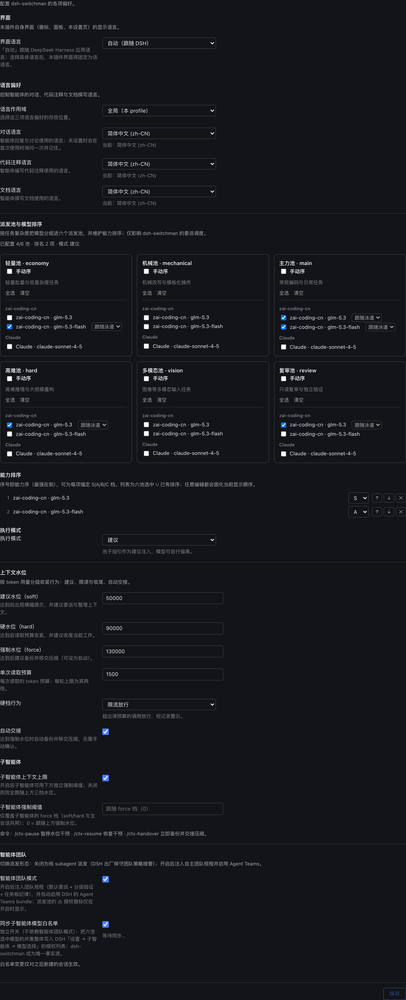

# dsh-switchman

[English](./README.md) | **简体中文** | [繁體中文](./README.zh-TW.md) | [日本語](./README.ja.md) | [한국어](./README.ko.md) | [Español](./README.es.md) | [Français](./README.fr.md) | [Deutsch](./README.de.md) | [Italiano](./README.it.md) | [Português](./README.pt.md) | [Русский](./README.ru.md)

> **switchman 家族**，同一作者、同一套调度理念：[opencode-switchman](https://github.com/mrzturn/opencode-switchman)（OpenCode 原版）· [zcode-switchman](https://github.com/mrzturn/zcode-switchman)（ZCode 移植）· **dsh-switchman**（本仓库，DeepSeek Harness 版）。


> 上下文装上水表，任务自己找车道。

## 为什么需要它

用 DSH 干活久了有两件烦心事：一是会话越聊越重，上下文被历史撑到几十万 token，模型开始忘事、变慢、变贵，手动 /compact 又丢细节；二是主力模型什么都自己干，查个文件、跑个测试、对个数据都是它在啃，大半活其实该交给便宜模型。

dsh-switchman 是一个 [DeepSeek Harness](https://github.com/deepseek-ai/deepseek-harness)（DSH）插件。装上之后，主模型从「亲自干活」变成调度员：量水位、选车道、派任务、盯验收。它不是新模型，是一套挂在 DSH 上的调度规程加一个配置界面，一共做七件事：

**1. 上下文水位：长会话不撑爆。** 每轮实时统计会话 token，三条水位线逐级加码：50k（soft，可调）提醒「该委派了」；90k（hard）收紧单次读取预算、引导收尾；130k（force）自动交接——fork 一份会话留底、压缩上下文、唤醒续跑，任务不断线。交接那一刻还在跑的后台子智能体也不会丢：id、任务、报告路径都写进交接文档，续跑的会话知道去哪收报告，不会重复派活。每个子智能体自带独立硬顶，到顶写完 HANDOFF 摘要退场。自动干预不合手时可临时接管：`/ctx-pause` 停掉全部水位动作（测量照跑、横幅转成 paused，只是不动手），`/ctx-resume` 随时恢复——重启 DSH 后干预也会自动回来，是临时放手，不是永久关闭；`/ctx-handover` 不等水位到顶，主动发起同一次交接：fork 备份、压缩上下文、唤醒续跑（会话先被引导到空闲边界，结果可能要等几分钟）。

**2. 六个派发池：什么活配什么模型。** 轻量池（批量小活）、机械池（模板化改写）、主力池（日常编码）、高难池（高难推理与大规模重构）、多模态池（看图）、复审池（独立验证）。设置页里勾候选、排优先级、标 S/A/B/C 档，还能给每条路线单独钉思考强度——档位下拉来自该模型真实支持的级别，不是通用三档。主模型每轮提示词里都带着一张 `[SWITCHMAN:POOLS]` 推荐表，照表派活。执行模式三态：关闭 / 建议 / 强制（强制 = 池外模型直接拒绝）。

**3. Agent Teams 模式：从单干到带团队。** 默认关闭，装完就是轻量的 subagent 派发。设置页两个独立开关：

- **智能体团队模式**——打开后注入团队规程（默认委派 + 分级验证 + 共享任务板纪律），并自动启用 DSH 的 Agent Teams：主模型可以拉常驻队友（`spawn_teammate`）、往共享任务板派活（`team_task_*`）、和队友互发消息。什么时候建团队有明确纪律：可并行的独立子任务、量大且自包含、主上下文水位已高、需要角色分离；一次性的单点调查仍走 subagent。再关掉开关，团队条款零残留，也不会撤走正在运行的会话里的团队工具。
- **同步子智能体模型白名单**——DSH 有张「允许 Agent 为子智能体选择模型」的授权白名单：池里选了但没授权的路线，点名派发会被拒（团队模式下会标 ⚠）。打开这个开关，六个池的并集整体写入那张白名单——switchman 做唯一事实源，不用两边重复配置。白名单按「新建会话」快照生效，同步只对之后新开的会话起作用。

会话头部有直观反馈：⚡「自主团队」徽标、◇ 当前会话实际模型；自动交接进行时出现「交接进行中 · 备份会话 / 压缩上下文 / 唤醒续接」的实时提示。

**4. 语言偏好：问一次，记一辈子。** 回复、代码注释、文档三种语言各一个下拉，作用域可选全局或按项目（`.switchman/lang.json`）。不设也行——首次用到时用你 DSH 界面的语言问一次，记住后每个会话自动遵守。

**5. 界面语言：插件自己也说你的话。** 设置页顶部的「界面」区里一个「界面语言」下拉（设置键 `uiLocale`）：自动（默认，跟随 DeepSeek Harness 应用语言），或手动选任一内置界面语言——选项一律显示语言原名、不作翻译。它只切换本插件自己的界面（徽标、首页面板、设置页），不动 DSH 应用语言：选中即实时预览、无需重启，保存后记住、下次启动自动恢复，任何失败都回退到应用语言；词典全部内联在插件包里，无需下载。

**6. 分级验证：改完必查。** 超过 20 行的改动交 tester 验证；超过 300 行、或动了核心 / 安全 / 数据一致性逻辑，再交一个 reviewer 独立复审。复审模型锚定「写出这份 diff 的智能体」所用的模型来选，尽量避开；池里实在避不开时，会在结论里声明 DOWNGRADED。你说一句「不要用团队」，它立刻退回单干。

**7. `/vision`：纯文本模型也能处理图。** 主力模型读不了图时，DSH 会在入口直接拒掉带图消息。贴上图、输入 `/vision 这张图错在哪`，图片会被交给多模态池的模型去读，结论回到当前会话。输入框上方会提前提示「当前模型不支持读图」；直接发图被拒时，自动改写成 `/vision` 重发一次，不用手动重来；多模态池没配时命令会拒绝并给出配置指引。

只有一个模型也值得装——水位控制和分级验证与模型数量无关，单模型长会话同样受益。

## 捆绑技能

- **db-query**——MySQL / Redis 只读核验：跑 SQL 对数、查缓存键 / TTL、跨库一致性检查，拒绝一切写入。首次使用需初始化（见下）。
- **git-commit-message**——生成规范的 commit 文案，只出文本，从不替你 git。
- **requirement-docs**——需求分析 / PRD / 设计文档的统一规范，产出归档到 `docs/requirements-and-design/`。

## 快速上手

1. **安装**——任意会话里让 agent 执行，或在 Web 插件管理页：

   ```
   plugin_manager: install_bundle  target=dsh-switchman
   ```

   或从本地检出安装（link 方式；更新后需 `remove_bundle` + `install_bundle` 重装）：

   ```
   plugin_manager: install_bundle  target=/path/to/dsh-switchman
   ```

   或在终端用 `dsh` 命令——按运行方式选对应的 profile：

   ```bash
   dsh plugin --profile web add dsh-switchman      # Web GUI
   dsh plugin --profile desktop add dsh-switchman   # 桌面应用
   ```

2. **重启 DSH**——完全退出应用再打开（刷新页面不算），客户端模块表才能识别本 bundle。

3. **配置**——设置 → dsh-switchman，或首页侧边栏的「Switchman 调度中心」。配置就一页，长这样，从上往下过一遍就配完了：

   

   - **界面**——插件自己的界面语言。图中「自动」即跟随 DSH 应用语言；选具体语言则当场整页切换，保存后记住，随时切回「自动」。
   - **语言**——智能体产出物的语言。作用域图中为「全局（本 profile）」（也可按项目，各自读 `.switchman/lang.json`）；回复 / 代码注释 / 文档三个下拉图中都定在简体中文，每项下方有「当前：…」状态行。全不设也行，首次用到问一次、记住即用。
   - **派发池**——六张卡片两行三列：上排轻量、机械、主力，下排高难、多模态、复审。卡片按供应商分组勾候选模型；勾上「手动序」变成编号优先列表，用 ↑ ↓ × 调顺序；每条路线可钉思考强度（默认「跟随泳道」）。顶部汇总行实时更新，图中即「已配置 4/6 池 · 排名 2 项 · 模式 建议」。
   - **能力排序 + 执行模式**——六池选中模型的并集按能力排序、最强在前（图中 glm-5.3 锚 S 档、glm-5.3-flash 锚 A 档），可调序、可删减；执行模式建议 / 强制（强制 = 池外模型直接拒绝）。
   - **智能体团队**——团队模式与白名单同步两个开关，默认全关；图中为开启状态，开关下方有同步状态行。
   - **上下文水位**——三档阈值（图中 50000 / 90000 / 130000）、单次读取预算（1500）、硬档行为（限流放行 / 拦截）、自动交接开关、子智能体独立上限，都在这区。底部一行命令：`/ctx-pause` 暂停干预 · `/ctx-resume` 恢复 · `/ctx-handover` 立即备份交接（它会把会话引导到空闲边界再压缩，结果可能要等几分钟）。

4. **验证**——会话头部出现 ⚡「自主团队」徽标（旁边 ◇ 显示当前会话模型）；或者直接问模型「你系统提示词最后一段标题是什么」，答案应提到 dsh-switchman 规程。

**db-query 首次使用初始化**（脚本依赖装在技能目录内，不污染项目）：

```bash
bash <安装目录>/skills/db-query/scripts/setup.sh
```

## 工作原理

- Host 半（`index.js` + `host/`）注入动态系统提示词段（语言 / 泳道 / 水位 / 团队）、读预算与 enforce 双闸、四个斜杠命令（ctx 三件套 + `/vision`）。设置保存后下一轮提示词装配即生效，无需重启。
- Client 半（`client.js`）渲染设置页、会话头部的 ⚡ 徽标与 ◇ 模型标识、交接进行中的动态提示；配置快照经 Host 路由家族读写。
- 首页侧边栏的「Switchman 调度中心」入口，单击即以中央面板打开同一配置页；原设置入口保留。
- `cordis.patch.yml` 完整保留出厂预设的插件列表，只在 persona suffix 上做扩展；Agent Teams 工具本体来自出厂 bundle，开启团队模式时自动启用。

## 维护注意

- DSH 升级后若出厂预设插件列表有变，从新的 `presets/*.patch.yml` 重新同步 `cordis.patch.yml`（保留 doctrine suffix），然后重装。
- 协议行（`[SWITCHMAN:LANG|POOLS|WATERMARK|TEAMS]`）刻意保持英文且字节稳定——不要本地化。
- `npm pack --dry-run` 应保持审计过的 50 文件 / ~205 kB 形态（`docs/` 截图不进包）。

## License

MIT
