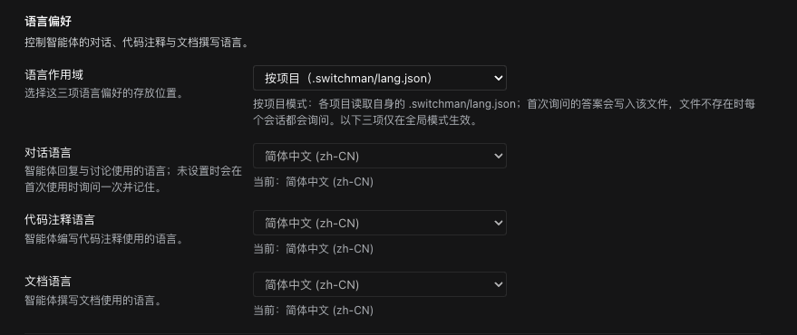
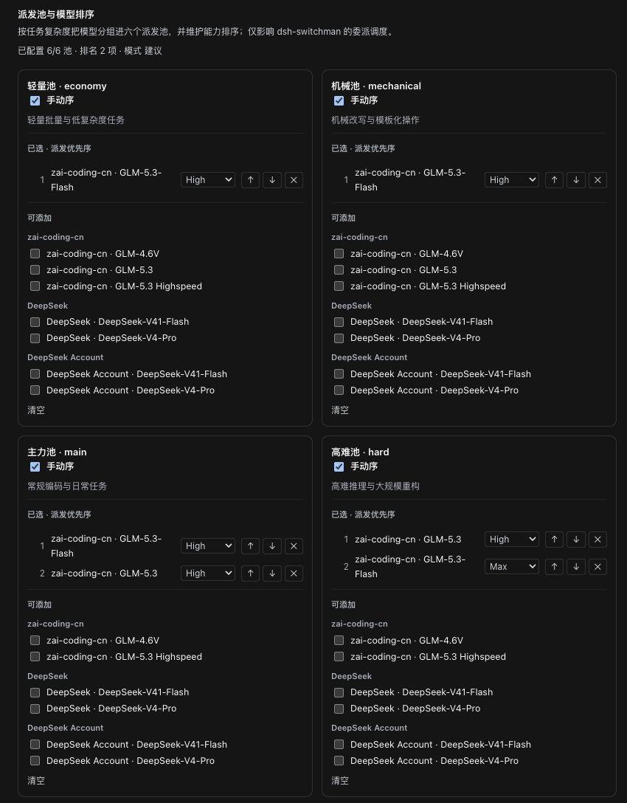
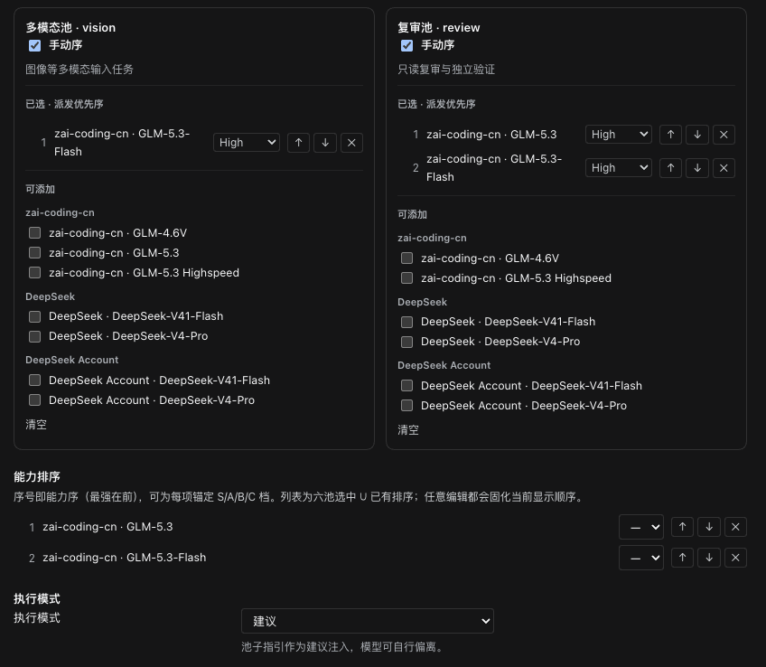
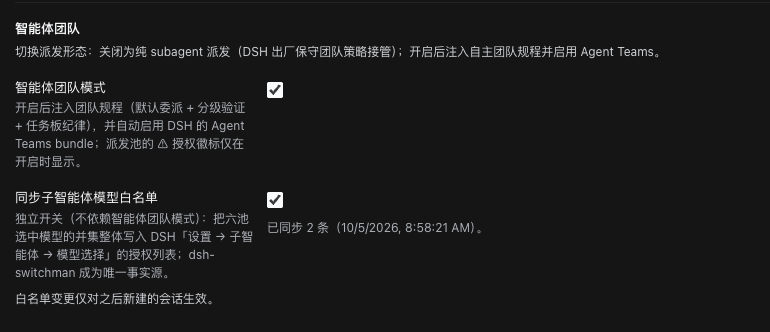
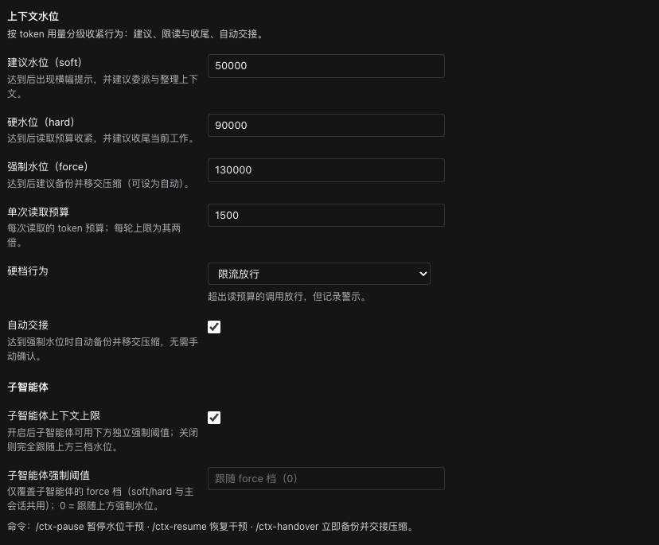

# dsh-switchman

[English](./README.md) | **简体中文** | [繁體中文](./README.zh-TW.md) | [日本語](./README.ja.md) | [한국어](./README.ko.md) | [Español](./README.es.md) | [Français](./README.fr.md) | [Deutsch](./README.de.md) | [Italiano](./README.it.md) | [Português](./README.pt.md) | [Русский](./README.ru.md)

> **switchman 家族**，同一作者、同一套调度理念：[opencode-switchman](https://github.com/mrzturn/opencode-switchman)（OpenCode 原版）· [zcode-switchman](https://github.com/mrzturn/zcode-switchman)（ZCode 移植）· **dsh-switchman**（本仓库，DeepSeek Harness 版）。


> 上下文装上水表，任务自己找车道。

## 为什么需要它

用 DSH 干活，时间一长会撞上两件事：

1. **会话越聊越重。** 上下文被历史撑到几十万 token，模型开始忘事、变慢、变贵，最后只能手动 /compact，一压又丢细节。
2. **主力模型什么都自己干。** 查个文件、跑个测试、对个数据都是它在啃——又慢又烧钱，其中大半其实该交给便宜模型。

dsh-switchman 是一个 [DeepSeek Harness](https://github.com/deepseek-ai/deepseek-harness)（DSH）插件。装上之后，主模型从「什么都自己干」变成调度员：量水位、选车道、派任务、盯验收。它不是一个新模型，是一套挂在 DSH 上的调度规程加一个配置界面。具体做六件事：

**1. 上下文水位：长会话不撑爆。** 每轮实时统计会话 token，三条水位线逐级加码：50k（soft，可调）提醒「该委派了」；90k（hard）收紧单次读文件的预算、引导收尾；130k（force）自动交接——fork 一份会话留底、压缩上下文、唤醒续跑，任务不断线。交接那一刻还在跑的后台子智能体也不会丢：id、任务描述、报告路径都写进交接文档，续跑的会话知道去哪收报告，而不是重复派活。派出去的每个子智能体自带独立硬顶，到顶写完 HANDOFF 摘要退场。

**2. 六个派发池：什么活配什么模型。** 轻量池（economy，批量小活）、机械池（mechanical，模板化改写）、主力池（main，日常编码）、高难池（hard，高难推理与大规模重构）、多模态池（vision，看图）、复审池（review，独立验证）。设置页里勾候选、排优先级（可标 S/A/B/C 档）、给每条路线单独钉思考强度——档位下拉来自该模型真实支持的级别，不是通用三档。主模型每轮提示词里都带着一张 `[SWITCHMAN:POOLS]` 推荐表，照表派活。执行模式三态：关闭 / 建议 / 强制（强制 = 池外模型直接拒绝）。

**3. Agent Teams 模式：从单干到带团队。** 默认关闭，装完就是轻量的 subagent 派发。设置页两个独立开关：

- **智能体团队模式**——打开后注入团队规程（默认委派 + 分级验证 + 共享任务板纪律），并自动启用 DSH 的 Agent Teams：主模型可以拉常驻队友（`spawn_teammate`）、往共享任务板派活（`team_task_*`）、和队友互发消息（`send_message`）。什么时候建团队有明确纪律：可并行的独立子任务、量大且自包含的活、主上下文水位已高、需要角色分离；一次性的单点调查仍走 subagent。DSH 出厂策略是「用户不点名就不建团队」，这里反转成「该用就用」。再关掉开关，团队条款零残留，也不会撤走正在运行的会话里的团队工具。
- **同步子智能体模型白名单**——DSH 有张「允许 Agent 为子智能体选择模型」的授权白名单：池里选了但没授权的路线，主模型点名派发会被拒（团队模式下，推荐表和设置页会给这些路线标 ⚠）。打开这个开关，六个池的并集整体写入那张白名单——不用两边重复配置，switchman 是唯一事实源，fork 派发路径也一并纳入。白名单按「新建会话」快照生效，同步只对之后新开的会话起作用。

会话头部有直观反馈：⚡「自主团队」徽标、◇ 当前会话实际模型；自动交接进行时会出现「交接进行中 · 备份会话 / 压缩上下文 / 唤醒续接」的实时提示。

**4. 语言偏好：问一次，记一辈子。** 回复、代码注释、文档三种语言各一个下拉，作用域可选全局或按项目（`.switchman/lang.json`）。不设也行——首次用到时用你 DSH 界面的语言问一次，记住后每个会话自动遵守。

**5. 分级验证：改完必查。** 超过 20 行的改动交 tester 验证；超过 300 行、或动了核心 / 安全 / 数据一致性逻辑，再交一个 reviewer 独立复审。复审模型锚定「写出这份 diff 的智能体」所用的模型来选，尽量避开；池里实在避不开时，会在结论里声明 DOWNGRADED。你说一句「不要用团队」，它立刻退回单干。

**6. `/vision`：纯文本模型也能处理图。** 主力模型读不了图时，DSH 会在入口直接拒掉带图消息。贴上图、输入 `/vision 这张图错在哪`，图片会被解析成文件路径交给多模态池的模型去读，结论回到当前会话。输入框上方会提前提示「当前模型不支持读图」；直接发图被拒时，自动改写成 `/vision` 重发一次，不用手动重来；多模态池没配时命令会拒绝并给出配置指引。

只有一个模型？也值得装——水位控制和分级验证与模型数量无关，单模型长会话同样受益。

## 捆绑技能

- **db-query**——MySQL / Redis 只读核验：跑 SQL 对数、查缓存键 / TTL、跨库一致性检查，拒绝一切写入。首次使用需初始化（见下）。
- **git-commit-message**——生成规范的 commit 文案，只出文本，从不替你 git。
- **requirement-docs**——需求分析 / PRD / 设计文档的统一规范，产出归档到 `docs/requirements-and-design/`。

## 快速上手

1. **安装**——任意会话里让 agent 执行，或在 Web 插件管理页：

   ```
   plugin_manager: install_bundle  target=dsh-switchman
   ```

   或从本地检出安装（link 方式；更新后需 `remove_bundle` + `install_bundle` 重装）：

   ```
   plugin_manager: install_bundle  target=/path/to/dsh-switchman
   ```

   或在终端用 `dsh` 命令安装——按运行方式选对应的 profile：

   ```bash
   dsh plugin --profile web add dsh-switchman      # Web GUI
   dsh plugin --profile desktop add dsh-switchman   # 桌面应用
   ```

2. **重启 DSH**——完全退出应用再打开（刷新页面不算），客户端模块表才能识别本 bundle。

3. **语言偏好**——设置 → dsh-switchman，或首页侧边栏的「Switchman 调度中心」。第一屏先选作用域：全局（本 profile）或按项目（各项目 `.switchman/lang.json`）；再用三个下拉分别定回复 / 注释 / 文档的语言，每项下方有「当前：…」状态行。跳过也没关系，首次使用会问一次并记住（提问语言跟随 DSH 界面语言）。

   

4. **配派发池**——每张池卡片按供应商分组勾选候选模型；勾上「手动序」后卡片变成编号优先序列表，用 ↑ ↓ × 调顺序，每条路线旁还能钉思考强度（默认「跟随泳道」，钉死后列出该模型真实支持的档位）。顶部汇总行实时反映进度，比如「已配置 6/6 池 · 排名 2 项 · 模式 建议」。

   

   多模态池和复审池在下方；再往下是**能力排序**（六池选中模型的并集，序号即能力序、最强在前，可锚 S/A/B/C 档）和**执行模式**（建议 / 强制）。

   

5. **智能体团队**——两个开关默认关闭，先用纯 subagent 模式跑起来。想让它自己拉团队，开「智能体团队模式」；想省掉两边重复授权，开「同步子智能体模型白名单」——开关下方有「已同步 N 条 + 时间」的状态行，确认写入结果。

   

6. **上下文水位**——三档阈值（默认 50000 / 90000 / 130000）、单次读取预算、硬档行为（限流放行 / 拦截）、自动交接开关、子智能体独立上限，都在这一区。底部一行命令：`/ctx-pause` 暂停干预 · `/ctx-resume` 恢复 · `/ctx-handover` 立即备份交接（它会把会话引导到空闲边界并等待压缩重试窗口，结果可能要等几分钟）。

   

7. **验证**——会话头部出现 ⚡「自主团队」徽标（旁边 ◇ 显示当前会话模型）；或者直接问模型「你系统提示词最后一段标题是什么」，应提到 dsh-switchman 规程。

**db-query 首次使用初始化**（脚本依赖装在技能目录内，不污染项目）：

```bash
bash <安装目录>/skills/db-query/scripts/setup.sh
```

## 工作原理

- Host 半（`index.js` + `host/`）注入动态系统提示词段（语言 / 泳道 / 水位 / 团队）、读预算与 enforce 双闸、四个斜杠命令（ctx 三件套 + `/vision`）。全部设置保存后下一轮提示词装配即生效，无需重启。
- Client 半（`client.js`）渲染设置页、会话头部的 ⚡ 徽标与 ◇ 模型标识、交接进行中的动态提示，走官方 settings-form 服务。
- 首页侧边栏的「Switchman 调度中心」入口，单击即以中央面板打开同一配置页（语言偏好、派发池与排序、水位）；原设置入口保留。
- `cordis.patch.yml` 完整保留出厂预设的插件列表，只在 persona suffix 上做扩展；Agent Teams 工具本体来自出厂 bundle，开启团队模式时自动启用。

## 维护注意

- DSH 升级后若出厂预设插件列表有变，从新的 `presets/*.patch.yml` 重新同步 `cordis.patch.yml`（保留 doctrine suffix），然后重装。
- 协议行（`[SWITCHMAN:LANG|POOLS|WATERMARK|TEAMS]`）刻意保持英文且字节稳定——不要本地化。
- `npm pack --dry-run` 应保持审计过的 50 文件 / ~205 kB 形态（`docs/` 截图不进包）。

## License

MIT
